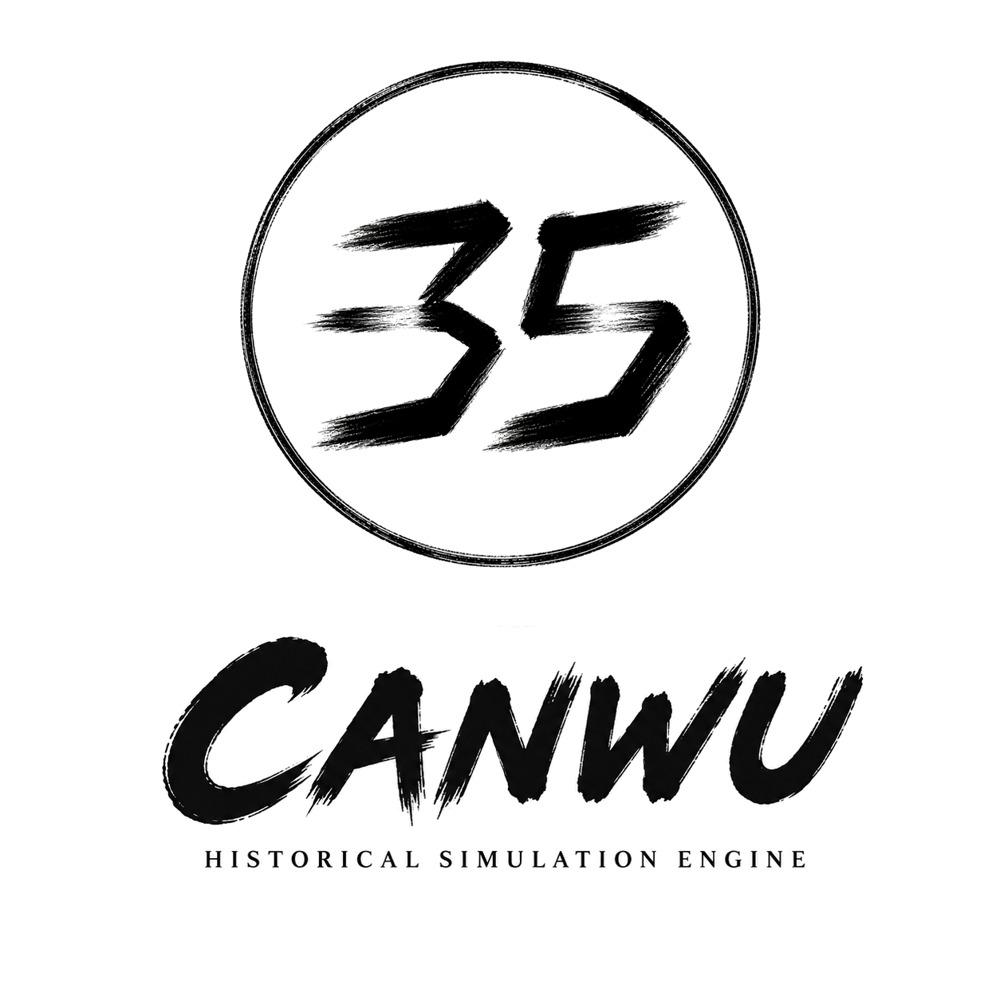

# Canwu（参伍 / 35 Engine）

[English](README.md) | [简体中文](README.zh-CN.md)



Canwu is a headless historical simulation engine written in Rust. It simulates
a historical world, advances time in a repeatable way, accepts validated
commands, and records events and their causes. It can also represent what each
person knows instead of giving every actor access to the true world state.

Canwu does not render graphics, play audio, or provide a production user
interface. Games, research tools, Python programs, web clients, and AI agents
use Canwu through its public APIs.

The current v0.3 development slice retains the small movement scenario and adds
a deterministic fourteen-phase settlement boundary for Celestial Mandate-style
domain plugins. Plugins can declare phased reads and writes, compete for
reservations through stable allocation rules, stage same-boundary or
next-boundary changes, and persist exact boundary evidence for replay. The
movement scenario still demonstrates validated commands, scheduled travel,
causal events, and actor-specific delayed knowledge. This is meaningful progress
toward the CM profile, not a claim of full conformance.

## Workspace

- `canwu-core`: stable IDs, repeatable random numbers, and schema metadata
- `canwu-time`: historical time that is independent of rendering speed
- `canwu-event`: stored events and links between causes and effects
- `canwu-world`: historical entities and read-only world snapshots
- `canwu-knowledge`: what each actor knows and when they learned it
- `canwu-sim`: private simulation state, commands, scheduling, and plugins
- `canwu-api`: public APIs for programs, agents, explanations, and debugging
- `canwu-debug`: a small reference client built only on the public API

Read [the architecture](docs/architecture.md) and
[end-state design](docs/end-state.md) before changing boundaries. Release and
compatibility rules are defined in [versioning](docs/versioning.md).

## Version and platforms

Canwu uses Semantic Versioning, with all workspace crates currently at `0.3.0`
and released in lockstep. The canonical version is in the root `Cargo.toml`.

The supported operating systems are Windows, macOS, and Linux. The simulation
crates are headless and platform-neutral; the reference debug client uses
OpenGL through `eframe`, with Wayland and X11 enabled on Linux. The CI matrix
checks all three operating systems.

## Development

See [CONTRIBUTING.md](CONTRIBUTING.md) for local setup, development commands,
project rules, and the Contributor License Grant. External contributors must
accept that grant when opening a pull request.

## Agent skills

Agent-facing integrations live under [`agent-interface`](agent-interface/).
External users can use the
[`canwu-engine-usage`](agent-interface/plugins/canwu-engine/skills/canwu-engine-usage/SKILL.md)
skill. Contributors and maintainers use skills under
[`canwu-developer`](agent-interface/plugins/canwu-developer/skills/); the release
workflow is
[`canwu-developer-release`](agent-interface/plugins/canwu-developer/skills/canwu-developer-release/SKILL.md).

## Minimal API Example

```rust
use canwu_api::{Canwu, Command, CommandEnvelope, Issuer, SimDuration};

let mut canwu = Canwu::demo(35)?;
let ids = Canwu::demo_ids();

canwu.submit(CommandEnvelope::new(
    Issuer::Actor(ids.commander),
    Command::MoveArmy {
        army: ids.army,
        destination: ids.eastern_territory,
    },
))?;
let events = canwu.advance(SimDuration::days(1))?;
# Ok::<(), canwu_api::CanwuError>(())
```

See `crates/canwu-api/examples/phased_boundary.rs` for an API-only plugin that
offers and claims a conserved resource, consumes its declared allocation, and
commits attributable boundary evidence.

## License

This project is source-available under the Canwu License 1.0. Personal,
community, research, educational, nonprofit, and commercial use is
royalty-free while a Product Family remains at or below $10 million in revenue
during its applicable 12-month measurement period. Progressive marginal
royalties apply only to revenue above that threshold. Commercial products must
display an [official Canwu logo](BRANDING.md) and include a Canwu
acknowledgement in the product or its user-facing materials. Proprietary
products are permitted, and independent downstream code does not need to be
disclosed or open-sourced. See [LICENSE](LICENSE) for the authoritative terms.
Third-party dependencies remain under their own licenses; see
[THIRD_PARTY_LICENSES.md](THIRD_PARTY_LICENSES.md).
