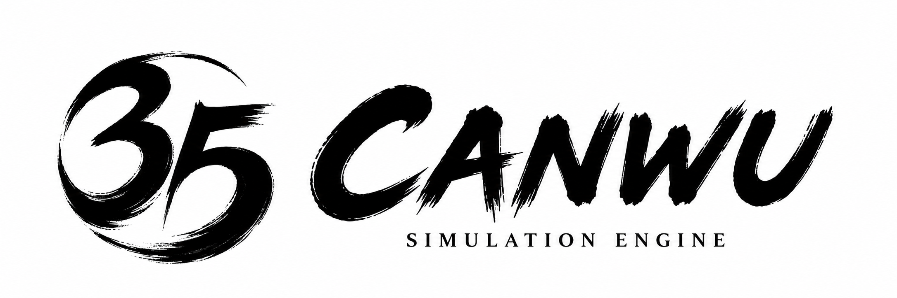

# 参伍引擎 Canwu Engine

[English](README.md) | [简体中文](README.zh-CN.md)

Website: [canwu.org](https://canwu.org)



Canwu is a headless historical simulation engine written in Rust. It simulates
a historical world, advances time in a repeatable way, accepts validated
commands, and records events and their causes. It can also represent what each
person knows instead of giving every actor access to the true world state.

Canwu does not render graphics, play audio, or provide a production user
interface. Games, research tools, Python programs, web clients, and AI agents
use Canwu through its public APIs.

Canwu is built for simulations that need more than a mutable game-state object.
It provides deterministic time, validated authority-aware commands, atomic
settlement, actor-relative knowledge, typed extension points, causal evidence,
save/load validation, exact replay, and explicit live evidence sealing. The
engine remains domain-neutral:
applications define their own rules and content through public contracts rather
than adding application-specific types to the kernel.

The project is under active development. The public examples are small on
purpose: they make the engine's guarantees easy to inspect, test, and reuse in
larger games, research environments, and agent-driven simulations.

## Use Canwu as a dependency

Rust applications should depend on the supported public API rather than the
implementation crates:

```toml
[dependencies]
canwu-api = "=0.6.0"
```

Applications that persist Canwu snapshots should pin a published engine
release exactly and upgrade only alongside an explicit save migration. The
example above selects the immutable `0.6.0` release rather than the moving
`main` branch.

The crates in `canwu-api`'s dependency graph are published so Cargo can resolve
the public API. They are not separate compatibility surfaces for application code.
The domain extensions are also published as crates.io packages so applications
can depend on an officially released extension version; they remain optional and
may evolve independently before 1.0.

## Quick start

Install Rust 1.88 or newer, then run the extracted reference-world starter:

```text
cargo run -p canwu-reference-world --example starter
```

For a phased, API-only plugin example:

```text
cargo run -p canwu-api --example phased_boundary
```

For a persisted decision-ticket example with dynamic options, utility
evaluation, authority-derived command execution, trace output, and exact
replay:

```text
cargo run -p canwu-api --example decision_ticket
```

For the social diffusion simulation module example:

```text
cargo run -p canwu-society --example local_community_diffusion
```

For the evidence-based technology flow:

```text
cargo run -p canwu-technology --example technology_diffusion
```

For routed local and Wuxi-to-Beijing correspondence:

```text
cargo run -p canwu-correspondence --example routed_correspondence
```

## How the repository fits together

- `canwu-core`: stable IDs, repeatable random numbers, and schema metadata
- `canwu-decision`: decision tickets, controllers, traces, utility evaluation,
  and policy SDK contracts
- `canwu-time`: historical time that is independent of rendering speed
- `canwu-event`: stored events and links between causes and effects
- `canwu-knowledge`: what each actor knows and when they learned it
- `canwu-routing`: deterministic, observer-relative route planning
- `canwu-transport`: itinerary, custody, booking, and delivery execution
- `canwu-sim`: private simulation state, commands, scheduling, and plugins
- `canwu-api`: public APIs for programs, agents, explanations, and debugging
- `canwu-reference-world`: replaceable example entities, detached projection,
  movement plugin, routing adapter, and runnable persistence/replay starter
- `canwu-debug`: a small reference client built on the public API and reference integration
- `canwu-information`: published information-lifecycle extension
- `canwu-correspondence`: published correspondence domain
  extension and simulation plugin built on routing, transport, and information
- `canwu-society`: published social diffusion simulation module;
  architecturally, a domain extension built on `canwu-api`
- `canwu-culture`: published culture authoring, compilation, and
  lifecycle extension built on `canwu-society`
- `canwu-technology`: published generic technology extension for evidence,
  local capability, implementation, use-specific adoption, and diffusion
- `canwu-history-research`: published optional historical assessment plugins
  kept downstream from base technology truth
- `canwu-fiscal`: published generic fiscal-procedure extension for regional
  law adoption, assessment, remission, authorization, receipts, and reports
- `canwu-ming-fiscal`: source-cited Ming reference content from 1368-1662,
  plus an optional Zheng continuation through 1683
- `canwu-ming-fiscal-reference`: runnable Hongwu, Wanli, and Hongguang scenario
  composition using the fiscal and reference-world plugins

The [crate map](crates/README.md) shows the repository layers, exact dependency
DAG, and publication order. The [documentation index](docs/README.md) links the
architectural contracts, community guidance, and legal notices.
`agent-interface` contains packaged skills for engine users. Repo-local
contributor skills live under `.agents/skills`, with Claude-compatible loaders
under `.claude/skills`; these are tooling, not runtime simulation plugins. The
`website` and `assets` directories contain the community site and project media.

Read [the architecture](docs/architecture.md) and
[end-state design](docs/end-state.md) before changing boundaries.

## Development

Contributions, bug reports, examples, documentation improvements, and careful
architecture discussions are welcome. See [CONTRIBUTING.md](CONTRIBUTING.md)
for local setup and contribution terms. Coding agents must also follow
[AGENTS.md](AGENTS.md) and any nearer instructions.

<details>
<summary><strong>Development flow</strong></summary>

1. Read `AGENTS.md`, `docs/architecture.md`, `docs/end-state.md`, and any nearer
   repository instructions for the area being changed.
2. Inspect `git status`. Preserve existing work and use a worktree for unrelated
   parallel changes.
3. State the invariant, identify every affected surface, and make the smallest
   coherent implementation. Keep semantic changes separate from large file
   moves or generated-file refreshes.
4. Treat tests as durable evidence. Commit a test only when it is necessary,
   reusable, very likely to fail under a plausible future change, and
   non-trivial: it must exercise a multi-step invariant, public contract,
   persistence/replay boundary, or failure-recovery path beyond format, lint,
   compile, or a simple accessor assertion. Run narrower one-off verification
   inline. Canwu uses no TDD requirement, test quota, or coverage target. Then
   run:

   ```text
   cargo fmt --all -- --check
   cargo clippy --workspace --all-targets -- -D warnings
   cargo test --workspace
   cargo check -p canwu-debug
   ```

5. Run affected public examples and `cargo doc --workspace --no-deps` when APIs
   or documentation change.
6. Obtain independent review for architectural, persistence, replay, authority,
   determinism, or performance work. Commit only coherent, passing milestones.

The detailed project hierarchy and change-surface map live in
[AGENTS.md](https://github.com/PeiyuanQi/canwu/blob/v0.5.1/AGENTS.md).

</details>

## Agent skills

Agent-facing engine integrations live under [`agent-interface`](https://github.com/PeiyuanQi/canwu/tree/v0.5.1/agent-interface).
External users can invoke
[`$canwu-engine-docs`](https://github.com/PeiyuanQi/canwu/blob/v0.5.1/agent-interface/plugins/canwu-engine/skills/canwu-engine-docs/SKILL.md)
to find and explain official tutorials and design documents, then use
[`$canwu-engine-usage`](https://github.com/PeiyuanQi/canwu/blob/v0.5.1/agent-interface/plugins/canwu-engine/skills/canwu-engine-usage/SKILL.md)
for public API guidance. Downstream game and historical-simulation developers
can use
[`$canwu-developer-create-simulation`](agent-interface/plugins/canwu-developer/skills/canwu-developer-create-simulation/SKILL.md)
to build a runnable vertical slice and
[`$canwu-developer-build-run-explorer`](agent-interface/plugins/canwu-developer/skills/canwu-developer-build-run-explorer/SKILL.md)
for seeded reruns and actor-relative timelines. Contributors and maintainers use
the native
[`canwu-contributor-design`](.agents/skills/canwu-contributor-design/SKILL.md)
and
[`canwu-contributor-release`](.agents/skills/canwu-contributor-release/SKILL.md)
skills. Claude-compatible loaders live under [`.claude/skills`](.claude/skills/)
and point to the appropriate canonical skill.
The human-readable package and registry procedure is documented in
[`docs/releasing.md`](https://github.com/PeiyuanQi/canwu/blob/v0.5.1/docs/releasing.md).

## Minimal API example

```rust
use canwu_api::{Canwu, CommandRequest, CommandRequestId, EntityRef, Issuer, SimDuration};
use canwu_reference_world::{
    MovementCommand, ReferenceWorldPlugin, demo_scenario, order_movement,
};

let (scenario, ids) = demo_scenario()?;
let plugin = ReferenceWorldPlugin;
let mut canwu = Canwu::new_with_plugins(35, scenario, &[&plugin])?;

let envelope = order_movement(
    Issuer::Actor(ids.commander),
    &MovementCommand {
        subject: EntityRef::Army(ids.army),
        destination: ids.eastern_territory,
        cargo: Vec::new(),
    },
)?
.at_time(canwu.time());
canwu.enqueue_command(
    canwu.time(),
    0,
    CommandRequest::new(CommandRequestId::new(1), canwu.revision(), envelope),
)?;
let events = canwu.advance_canonical(SimDuration::days(1))?;
# Ok::<(), canwu_api::CanwuError>(())
```

See `crates/api/canwu-api/examples/phased_boundary.rs` for an API-only plugin that
offers and claims a conserved resource, consumes its declared allocation, and
commits attributable boundary evidence.

## License

Canwu is open-source software licensed under the
[Apache License 2.0](https://github.com/PeiyuanQi/canwu/blob/v0.5.1/LICENSE). You may use, modify, and distribute Canwu in
open-source or proprietary products without royalties or revenue reporting.
Distributed copies must comply with the Apache License and preserve applicable
license and [NOTICE](https://github.com/PeiyuanQi/canwu/blob/v0.5.1/NOTICE) material. The Apache License does not require a
Canwu logo or public acknowledgement; the
[branding guide](https://github.com/PeiyuanQi/canwu/blob/v0.5.1/docs/community/branding.md) explains optional, non-endorsing
use of the project marks. Third-party dependencies remain under their own
licenses; see the
[third-party license inventory](https://github.com/PeiyuanQi/canwu/blob/v0.5.1/docs/legal/third-party-licenses.md).

## Supported platforms

The supported operating systems are Windows, macOS, and Linux. The simulation
crates are headless and platform-neutral; the reference debug client uses
OpenGL through `eframe`, with Wayland and X11 enabled on Linux. The CI matrix
checks all three operating systems. The workspace and published crates require
Rust 1.88 or newer.
