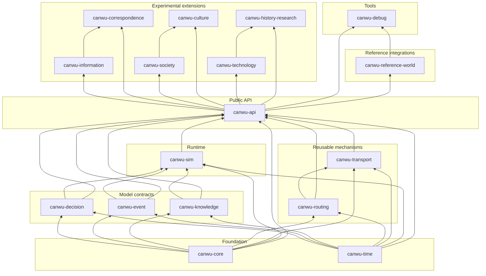

# Canwu crates

This directory is organized by dependency layer. The folder names help people
navigate the repository; published Cargo package names remain unchanged.
Applications should depend on `canwu-api`, not on the implementation crates
below it. Experimental extensions are published packages, but remain optional
and are not part of the supported public API surface.

## Dependency graph

Arrows point from a dependency to the crate that consumes it. The graph shows
direct first-party dependencies from the Cargo manifests.

## Layers

| Layer | Crates | Responsibility | Registry policy |
| --- | --- | --- | --- |
| `foundation/` | `canwu-core`, `canwu-time` | Stable identifiers, schemas, deterministic random primitives, and simulation time | Published |
| `model/` | `canwu-decision`, `canwu-event`, `canwu-knowledge` | Serializable model and policy contracts | Published |
| `mechanisms/` | `canwu-routing`, `canwu-transport` | Reusable planning and transport execution | Published |
| `runtime/` | `canwu-sim` | Authoritative state, commands, settlement, persistence, replay, and plugins | Published as an implementation dependency |
| `api/` | `canwu-api` | Supported application-facing Rust API | Published and recommended for applications |
| `extensions/` | `canwu-information`, `canwu-correspondence`, `canwu-society`, `canwu-culture`, `canwu-technology`, `canwu-history-research` | Experimental domain implementations built on the public API; culture remains downstream from society and historical research remains downstream from technology | Mixed |
| `integrations/` | `canwu-reference-world` | Replaceable example world, projection, movement plugin, routing adapter, and runnable starter | Not published |
| `tools/` | `canwu-debug` | Reference clients and maintainer tools | Not published |

## Registry order

Publish the lockstep version only from its tagged release commit, waiting for
each completed group to become resolvable before continuing:

1. `canwu-core`, `canwu-time`
2. `canwu-decision`, `canwu-event`, `canwu-knowledge`
3. `canwu-routing`, `canwu-sim`
4. `canwu-transport`
5. `canwu-api`
6. `canwu-information`, `canwu-society`, `canwu-technology`
7. `canwu-culture`, `canwu-correspondence`, `canwu-history-research`

See [the architecture](../docs/architecture.md), [versioning](../docs/versioning.md),
and [the release procedure](../docs/releasing.md) for the behavioral and
distribution contracts behind this graph.
