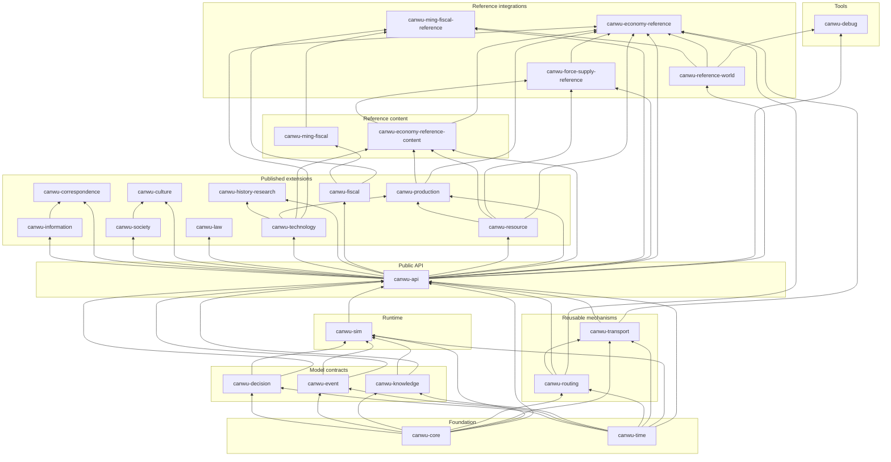

# Canwu crates

This directory is organized by dependency layer. The folder names help people
navigate the repository; published Cargo package names remain unchanged.
Applications should depend on `canwu-api`, not on the implementation crates
below it. Published domain extensions remain optional and are not part of the
supported public API surface.

## Dependency graph

Arrows point from a dependency to the crate that consumes it. The graph shows
direct first-party dependencies from the Cargo manifests.

## Layers

| Layer | Crates | Responsibility | Registry policy |
| --- | --- | --- | --- |
| `foundation/` | `canwu-core`, `canwu-time` | Stable identifiers, schemas, deterministic random primitives, and simulation time | Published |
| `model/` | `canwu-decision`, `canwu-event`, `canwu-knowledge` | Serializable model and policy contracts | Published |
| `mechanisms/` | `canwu-routing`, `canwu-transport` | Reusable planning and transport execution | Published |
| `runtime/` | `canwu-sim` | Authoritative state, commands, settlement, persistence, replay, and plugins | Published as an implementation dependency |
| `api/` | `canwu-api` | Supported application-facing Rust API | Published and recommended for applications |
| `extensions/` | `canwu-information`, `canwu-correspondence`, `canwu-society`, `canwu-culture`, `canwu-law`, `canwu-technology`, `canwu-history-research`, `canwu-fiscal`, `canwu-resource`, `canwu-production` | Domain implementations built on the public API; resource owns conserved quantities and fulfillment, production consumes resource and technology evidence, and fiscal procedure remains independent from resource balances and physical transfers | Published except for milestone-stage crates awaiting their release tag |
| `reference-content/` | `canwu-ming-fiscal`, `canwu-economy-reference-content` | Versioned, source-cited historical definitions and explicit synthetic fixtures compiled by generic extensions | Published |
| `integrations/` | `canwu-reference-world`, `canwu-ming-fiscal-reference`, `canwu-force-supply-reference`, `canwu-economy-reference` | Replaceable example worlds, adapters, scenario composition, force-supply consumers, and runnable starters | Not published |
| `tools/` | `canwu-debug` | Reference clients and maintainer tools | Not published |

## Registry order

Publish the lockstep version only from its tagged release commit, waiting for
each completed group to become resolvable before continuing:

1. `canwu-core`, `canwu-time`
2. `canwu-decision`, `canwu-event`, `canwu-knowledge`
3. `canwu-routing`, `canwu-sim`
4. `canwu-transport`
5. `canwu-api`
6. `canwu-information`, `canwu-society`, `canwu-technology`, `canwu-fiscal`, `canwu-resource`
7. `canwu-culture`, `canwu-law`, `canwu-correspondence`, `canwu-history-research`, `canwu-production`, `canwu-ming-fiscal`
8. `canwu-economy-reference-content`

See [the architecture](../docs/architecture.md), [versioning](../docs/versioning.md),
and [the release procedure](../docs/releasing.md) for the behavioral and
distribution contracts behind this graph.
