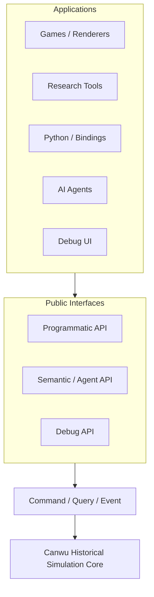
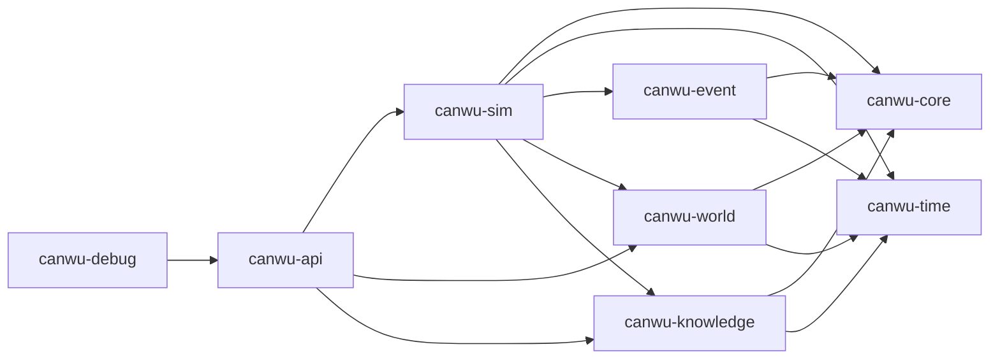
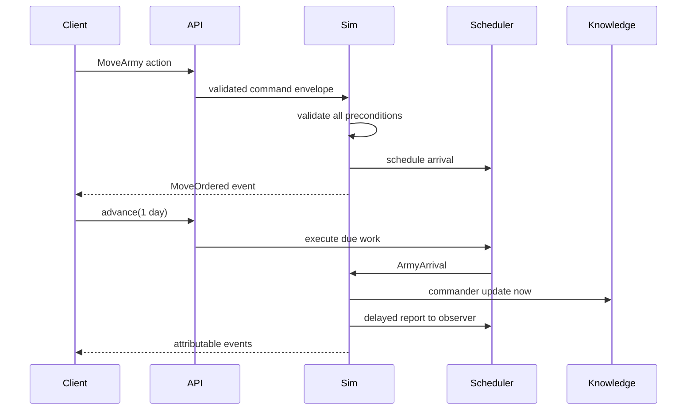

# Canwu Architecture

## Boundary

Applications never receive mutable access to live state. The programmatic API
can request an omniscient snapshot, but that snapshot is detached data. The
semantic API requires an actor and builds observations from that actor's
knowledge records.

## Dependency direction

`canwu-sim` owns the mutable runtime. `canwu-world` contains entity models and
read-only snapshots, not a public mutable world store. This makes the command
boundary a structural property instead of a UI convention.

## World, time, and events

A validated command produces an event and optional scheduled work. Scheduled
items are ordered by `(simulation timestamp, insertion sequence)`, so equal-time
work is deterministic. When work executes it may change state, emit a derived
event with a causal reference, update knowledge, and schedule further work.
Initial `Scenario` values currently admit stationary armies only: in-flight
state requires the command, event, correlation, and queue evidence carried by a
runtime snapshot. Scenario admission also rejects non-finite map coordinates so
every accepted state can round-trip through the JSON persistence format.

## Public interfaces

- Programmatic API: typed entity reads, commands, events, time, snapshots,
  forks, world diffs, schemas, and plugin descriptors.
- Query API: serializable entity selection, filters, selected fields, and
  limits for tools and bindings.
- Semantic API: `observe`, `inspect`, `query`, `available_actions`, `act`,
  `explain`, `wait`, and `describe_capabilities`.
- Debug API: omniscient reads plus explicitly debug-authorized commands. The
  reference UI uses the same command dispatcher as every other client.

Repository agent skills live under `agent-interface/`. The `canwu-engine`
plugin teaches external agents to use the public and semantic APIs. The
`canwu-developer` plugin contains contributor and release workflows. These
Codex skill plugins are development interfaces and are separate from runtime
`SimulationPlugin` implementations registered in `canwu-sim`.

## Knowledge model

Ground truth and knowledge are separate stores. An army knowledge record has a
known location, estimated strength range, observation time, learning time,
confidence in permille, and source. Semantic responses use those records and
filter event changes to facts visible to the requesting actor.

## Plugins

Plugins register schema, semantic action metadata, command handlers, and event
systems. Registration is transactional: duplicate plugin, command, system,
schema, or authoritative state ownership claims reject the complete plugin
registration without changing the live registry. Registered systems declare a
`SystemContract` containing their canonical boundary phase, cadence, read set,
write set, and visibility. The runtime enforces declared reads for both core
world collections and plugin-owned components, and it rejects every component
write that is undeclared or targets another owner's `StateKey`. Persisted
component identity is the typed tuple `(plugin, state key, entity, component)`;
text separators cannot alias records.

The current v0.2 executor supports event-driven, same-boundary systems only.
They execute by `(phase, plugin name, system name)`, never by registration
order. Other cadence and visibility values are present in the serialized
contract but registration rejects them until the canonical phased-boundary
runtime implements their semantics.

Command handlers receive an immutable `CommandContext` containing the issuer
asserted by the trusted in-process host, proposed command ID, simulation time,
and expected-time guard alongside the read-only simulation view. Canwu does not
authenticate a freely constructed `CommandEnvelope`; network, IPC, and account
adapters must authenticate callers before selecting an `Issuer`. Handlers
return directives and cannot take a mutable world reference. Directives can
update declared components, emit attributable custom events, or schedule future
directives.

Executable plugin handlers are stateless Rust function pointers. Deterministic
plugin state belongs in serialized, plugin-owned components; hidden mutex,
atomic, cache, counter, or RNG state is not part of the extension contract.
This keeps command rollback, failed-boundary recovery, forks, snapshots, and
replay independent.

Command application and each same-timestamp scheduled batch are transactional.
If fallible event or plugin processing fails, state, time, queues, events, and ID
counters return to the last successful transaction or timestamp boundary.
Plugin directives validate every referenced entity before mutation. Snapshot
loading also proves that pending arrivals agree with army transit, move commands,
order events, timestamps, and correlations, and that pending or completed report
delivery agrees with its dispatch and arrival evidence.

Executable handlers are not serialized. A snapshot stores validated plugin and
system descriptors. Continuation is blocked until every required plugin is
rehydrated, and registration must reproduce the exact stored descriptor before
its handlers become active. Use the plugin-aware snapshot/replay constructors
when executable packages are known at load time. Richer versioned package
manifests and automatic environment discovery remain required by the CM
conformance profile. New plugin registration closes after the first successful
authoritative command or time advance; exact snapshot rehydration remains
allowed after that point. Snapshots retain the run's initial time and reject a
registration-open flag when commands, events, queued work, component state,
counter movement, or elapsed simulation time proves execution already began.

## External renderer integration

Renderers consume snapshots and events: territory points, route endpoints, army
locations, relationships, movement events, and knowledge views. A renderer may
turn them into sprites, meshes, SVG, ASCII, or tables. None of those concepts
enter Canwu's state model.

## Portability and versions

The headless crates use portable Rust APIs and support Windows, macOS, and Linux.
Operating-system window-system features are confined to `canwu-debug`; Linux
enables Wayland and X11 while Windows and macOS use their native `eframe`
integration. CI verifies all three targets.

All first-party crates share one SemVer version from the workspace manifest.
Persistent snapshots additionally carry an independent format version so engine
releases and storage migrations do not have to move in lockstep.

## Celestial Mandate conformance

Canwu's first complete external-engine target is the reusable engine boundary
required by Celestial Mandate. The normative engine-neutral capability profile
is maintained in [`cm-engine-conformance.md`](cm-engine-conformance.md).

That profile does not move Celestial Mandate rules into Canwu. Instead, it
requires Canwu to provide the deterministic settlement, authority, ownership,
transaction, knowledge, persistence, lineage, package, and publication
contracts through public extension points. The current v0.2 movement slice is
foundational evidence only and is not a conformance claim.
