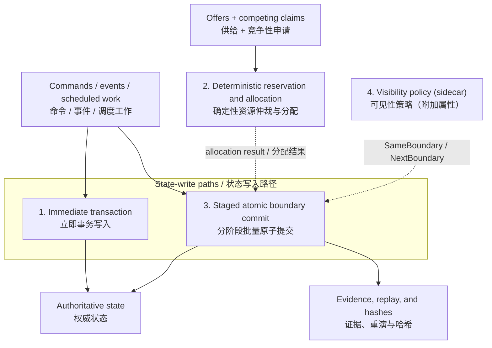
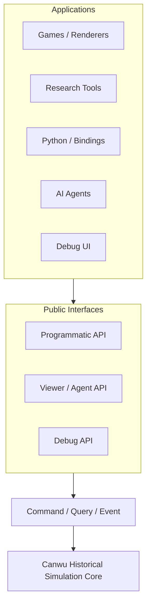
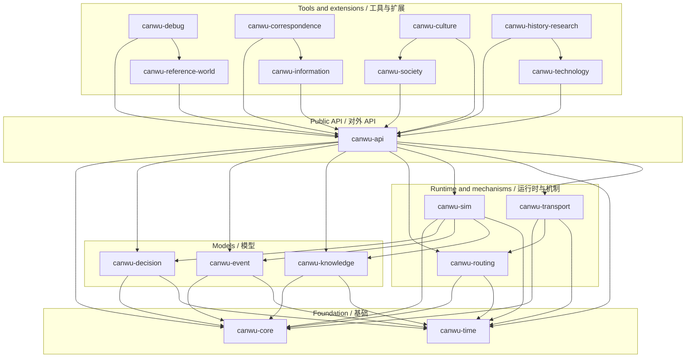
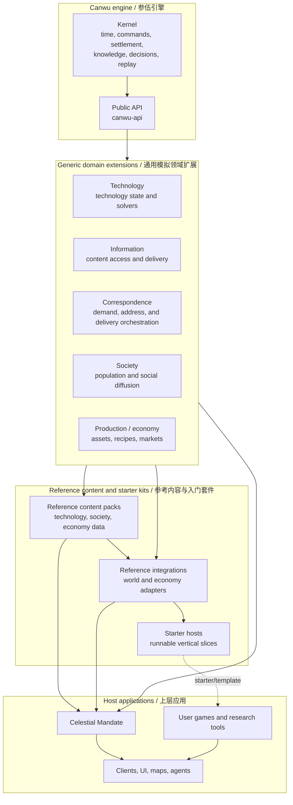
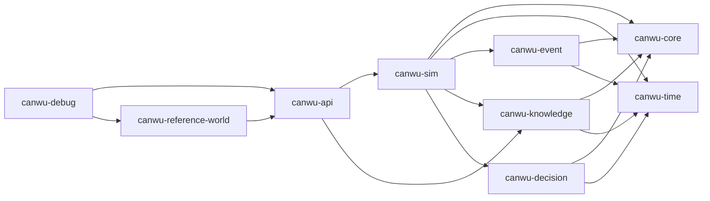
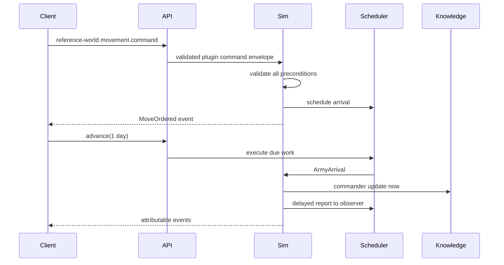

# Canwu Architecture

## Settlement foundations / 结算系统底层构成

Canwu exposes fourteen ordered settlement phases, but those phases are not
fourteen independent algorithms. At the lowest level, the runtime combines two
state-write paths, one deterministic allocation primitive, and one
cross-cutting visibility policy:

## Format 6 contract / Format 6 契约

Before 1.0, Canwu uses a clean persistence break. Format 6 requires a declared
run manifest, declared run configuration, canonical initial scenario, versioned
commitments, and a self-contained replay journal. The engine does not load or
silently migrate format-4/5 saves. `SimulationGranularity` supplies the generic
`aggregate` / `group` / `actor` levels; Population, Special Group, and Character
are Celestial Mandate mappings owned by a downstream reference integration.
Southern Ming and WWII content therefore does not belong in Canwu core.



### English

1. **Immediate transactional write** is the direct command/event path. The
   operation applies inside its own transaction and either commits completely
   or rolls back completely. It remains the compatibility path for the existing
   movement slice and legacy event reactors.
   Synchronous reactors are therefore compatibility-only: nested event
   re-entry is bounded by `MAX_SYNCHRONOUS_REACTION_DEPTH`, and a limit breach
   rolls back the enclosing transaction. New mechanics should use phased
   boundary systems, which collect proposals before one deterministic commit.
2. **Deterministic reservation and allocation** is a calculation primitive, not
   a state-write path. Systems publish capacity and competing claims; the
   kernel sorts them by pool, descending priority, explicit tie-break key, and
   reservation identity, then records a fulfilled, partial, or rejected result.
3. **Staged atomic boundary commit** is the authoritative batch-write path for
   new domain mechanics. Systems propose changes against one immutable boundary
   snapshot; the kernel validates the combined proposal and commits it as an
   atomic bundle, or restores the entire boundary on failure. Allocation results
   often feed this step, but it can also commit changes that do not use
   reservations.
4. **Visibility policy** is not a fourth settlement algorithm. It is a
   cross-cutting attribute attached to staged writes: `SameBoundary` exposes a
   value to later systems in the current boundary, while `NextBoundary` keeps it
   out of current-state reads until the boundary has finished. In other words,
   it is a sidecar-like policy on the staged commit path, not an independent
   writer or solver.

The practical classification is therefore: **1 and 3 are write mechanisms; 2
computes a result; 4 controls when a staged result becomes readable**. The
fourteen phases provide ordering, validation, evidence, and replay around these
foundations rather than introducing fourteen separate settlement models.

### 中文

1. **立即事务写入**是命令或事件的直接处理路径。操作在自己的事务中
   执行，要么完整提交，要么完整回滚。它仍是既有移动逻辑和旧式事件
   reactor 的兼容路径。
   因此，同步 reactor 只保留为兼容能力：嵌套事件重入受
   `MAX_SYNCHRONOUS_REACTION_DEPTH` 限制，超过限制会回滚整个外层事务。
   新机制应使用分阶段 boundary system，先收集提案，再统一确定性提交。
2. **确定性资源仲裁与分配**是一种计算原语，不是状态写入路径。系统先
   发布资源容量和竞争性申请；内核再按资源池、优先级（降序）、显式
   tie-break 键和 reservation identity（预留标识）进行排序，得出“满足、部分
   满足或拒绝”的分配结果。
3. **分阶段批量原子提交**是新领域机制使用的权威批量写入路径。各系统
   基于同一份不可变边界快照提出变更；内核统一校验整组提案，然后
   作为一个原子批次提交。任何致命错误都会恢复整个边界。资源分配结果
   经常在这里落地，但没有资源仲裁的变更也可以直接使用这条路径。
4. **可见性策略**不是第四种独立的结算算法，而是附着在分阶段写入上的
   横切属性：`SameBoundary` 让当前边界后续阶段可以读取结果；
   `NextBoundary` 则把结果隔离到本边界结束之后，下一边界才能从当前状态
   读到。也就是说，它类似 sidecar 的策略元数据，而不是独立的写入器或
   求解器。

因此最实用的分类是：**1 和 3 负责写入；2 负责计算分配结果；4 负责控制
   分阶段结果何时可读**。十四个阶段负责把这些底层机制组织成确定的顺序、
   校验、证据和重演流程，而不是提供十四种彼此独立的结算算法。

## Boundary



Applications never receive mutable access to live state. The programmatic API
can request generic authoritative records and evidence as detached data. The
viewer API binds an actor or institution and queries only that holder's
knowledge records. Concrete world projections belong to domain integrations.

## Workspace crate dependency DAG / 工作区 crate 依赖 DAG

The graph shows normal, direct dependencies between first-party workspace
crates. An arrow from A to B means **A depends on B**; external and development
dependencies are omitted. / 下图只展示第一方工作区 crate 之间的普通直接依赖。
A 指向 B 表示 **A 依赖 B**；外部依赖和开发依赖未列入。



## Architecture layers / 架构分层

Canwu is intentionally useful at more than one level. The engine supplies
deterministic simulation contracts; domain extensions supply reusable mechanics;
reference kits supply runnable defaults; and host applications decide which
world, content, presentation, and product rules to compose. The lower layers do
not depend on the historical content of the upper layers.



The arrows describe dependency and composition, not ownership of all the state
below them. A reference content pack is data consumed by a domain extension. A
reference integration is executable domain or host code that maps generic
capabilities to a small, inspectable world model. A starter host is a complete
consumer that demonstrates the composition without becoming part of the
kernel.

This classification prevents two opposite mistakes: putting historical or
opinionated examples into `canwu-core`, and leaving new users with only low-level
contracts and no working model to extend.

## Dependency direction



`canwu-sim` owns the mutable runtime. `canwu-reference-world` owns the example
entities and detached projection through typed domain records and plugin
commands. This makes the command boundary a structural property instead of a
UI convention.

### World and event model ownership / 世界与事件模型所有权

The dependency DAG above describes the current implementation, not the target
ownership of every public type. The accepted
[world and event ownership audit](proposals/world-event-ownership-audit.md)
establishes this invariant: generic engine crates own deterministic simulation
contracts, while reference integrations own period- and application-specific
world entities and event payloads. / 上面的依赖 DAG 描述当前实现，并不代表每个
公开类型的最终归属。已经接受的审计确立同一条边界：通用引擎 crate 拥有确定性
模拟契约，参考整合包拥有时代或应用特定的世界实体和事件载荷。

That ownership split is now complete: `canwu-reference-world` owns the model,
movement behavior, detached projection, and routing adapter; the source
`canwu-world` package has been retired from the workspace and dependency DAG.
The remaining `WorldSnapshot` projection is a current reference/runtime API,
not a persistence migration surface. Format 6 does not load old saves.
`canwu-event` now contains only generic contracts: `EventKind` is a type label
plus flattened structured fields, while concrete movement, arrival, letter,
report, knowledge, and debug payload structs live outside that crate. / 按此
方向，这项迁移已经完成：`canwu-reference-world` 拥有模型、移动行为、脱离式
投影和路由适配器；`canwu-world` 源码包已从 workspace 与依赖 DAG 退役。
当前 `WorldSnapshot` 只作为参考整合与运行时投影保留；Format 6 不加载旧存档。
`canwu-event` 现在只包含通用契约：`EventKind` 由类型标签和扁平化结构
字段组成，具体移动、到达、信件、报告、知识和调试载荷结构均位于该 crate 之外。

The event extraction is a Rust source-API break: callers replace enum
construction and exhaustive matching with `from_payload`, `event_type`,
`is_type`, and typed field/payload decoding. Format 6 also fixes canonical
field ordering and commitment versions; old format-4/5 snapshots and journals
are rejected rather than migrated. / 事件迁出会破坏 Rust 源 API：调用方需以通用
构造、类型标签和强类型字段或载荷解码替代枚举构造与穷举匹配。Format 6 同时固定
规范字段顺序并提升承诺版本；旧 format-4/5 快照和日志会被拒绝，不在内核中迁移。

## Decision framework

`canwu-decision` is the official headless decision SDK. It defines persisted
decision tickets, versioned dynamic options, controller bindings, persisted
decision attempts and traces, a reusable weighted utility evaluator, and Utility, Rule, Human,
External, and LLM policy contracts. Domain packages still define when a
decision exists, what its context means, which options are legal, and which
domain command an option represents.

The authoritative flow is:

```text
actor-relative facts -> DecisionTicket -> policy selects an existing option ID
    -> canonical decision ingress -> DecisionAttempt -> DecisionTrace
    -> validated command ingress
```

Policies do not receive mutable simulation state or command authority. A local
policy evaluates the explicit ticket projection and can select only an option
already present on that ticket. External and LLM adapters serialize an even
narrower request containing context and available option descriptors but no
authoritative action payload. Human, External, and LLM responses bind the
ticket version, so a response computed before `ReplaceOptions` is rejected as
stale. The controller binding, not the policy, derives command issuer, decision
origin, seat, permission profile, and command subject. Normal command admission
then validates that derived authority before any command mutation. A command
handler can also require `CommandContext::decision_controller_id`; the engine
sets it only for the nested command of validated decision ingress, so callers
cannot manufacture DecisionTicket provenance with `CommandEnvelope::with_authority`.

Registration, opening, option replacement, resolution, and cancellation enter
the runtime through `DecisionIngressRequest`. They use request IDs, revision
guards, deterministic queue order, transactional settlement, and exact-retry
semantics. A selected command option carries a serialized existing Canwu
command; it must exactly match the nested command request admitted with the
resolution. Decisions cannot bypass the command boundary or invent a new
authority envelope.

Decision state is authoritative persisted state. Snapshots retain controller
bindings, tickets, deadlines, versions, admission attempts, and traces; loading
validates entity identities and reconstructs accepted and rejected outcomes from
admitted decision ingress. Revision, ticket-version, closed-ticket, and similar
expected conflicts become persisted rejected attempts, so one bad request cannot
poison the canonical ingress queue. Decision and nested command request IDs are
nonzero and globally collision-checked before persistence. Decision state has
its own optional commitment root. Exact replay replays recorded decision ingress
and verifies the resulting attempts, state, and traces; it deliberately does not
rerun a possibly external, human, or nondeterministic policy.

### Deterministic outcomes, reloads, and forks

Deterministic replay is not an anti-save-scumming policy. Canwu guarantees that
the same authoritative state, command or decision ingress, plugin semantic
environment, and simulation-time inputs produce the same random draws and
outcomes. Reloading a snapshot before an already admitted event therefore does
not reroll that event. A host may still expose `fork()` or another branch
workflow so a player, AI planner, or researcher can try a different command;
that is a new causal branch, not a replay of the original run.

Whether a product permits manual save branches, exposes only one write-through
save, or offers research-only forks belongs to the host application's save
policy. The engine persists enough state for all three policies but does not
silently convert deterministic replay into irreversible play.

## Simulation domain extensions / 模拟领域扩展

Canwu calls an optional domain-specific module built on the public engine
contracts a **domain extension** (**模拟领域扩展**). A domain extension owns its
domain state, rules, commands, and actor projections while reusing kernel
infrastructure such as events, settlement, decisions, persistence, and replay.

`canwu-correspondence` is a published experimental correspondence domain
extension. It is also a runtime `SimulationPlugin`: the first term describes
ownership of reusable communication policy and evidence, while the second
describes how its authoritative commands and boundary systems execute. It
depends on `canwu-api` and `canwu-information`; neither dependency points back
to it.

`canwu-society` is a published experimental **social diffusion simulation
module** (**社会传播模拟模块**). It is a domain extension built on
`canwu-api`, not a dependency of `canwu-api` or a new kernel subsystem. It
models the reusable part of population-scale belief and affiliation change without introducing
religion-specific types into Canwu core.

Its authoritative root record contains ordered, sparse state for:

- cohorts with integer headcounts and application-defined classifications;
- active cohort/affiliation disposition distributions across separate
  awareness, private assent, practice, public alignment, organization tie,
  mobilization, and visibility dimensions;
- social influence edges and bounded organization topology;
- institutional alignments and orthogonal policy pressures;
- stable integer transition remainders, aggregates, mobilization candidates,
  and authorized observer estimates.

Daily transition rules execute in canonical key order with integer rates and
persisted per-rule remainders. Every active cohort/target distribution must
conserve the cohort headcount. Missing pairs are materialized only when a rule
actually addresses them, so runtime state grows with active relationships and
edges rather than a dense territory/cohort/target/channel product.

The social diffusion simulation module deliberately separates this chain:

```text
information exposure != awareness != private assent != public alignment
    != organization tie != mobilization candidate != political conflict
```

Institutional choices use ordinary `DecisionTicket` controllers and a
validated plugin command. The command records a pending policy component; the
next social boundary applies it to institutional alignment before proposing
population transitions. A ruler or policy therefore cannot directly set a
population belief percentage. Phase 10 produces mobilization candidates only;
downstream political or conflict packages decide what, if anything, follows.

Actor-facing queries require a valid `ViewerContext` and return only a
previously materialized projection for that actor. Absence is an authorization
error, never a request to decode the authoritative society record. Generic
snapshot validation checks the plugin manifest, record schema, commitments,
and referenced core-entity existence. The module-level
`from_society_snapshot_json` boundary additionally recomputes the society
payload-to-reference binding and every persisted aggregate, mobilization
candidate, actor projection, and pending institutional-policy component before
the restored simulation is returned. Optional materialization timestamps keep
`SimTime::EPOCH` and negative simulation times available as real boundary
times. Fork and exact replay use the same serialized authoritative state.

The culture authoring layer and downstream legal institutionalization extension
are specified together in the [culture and legal institutional systems](architecture-culture-law.md).
That design covers authored definitions, deterministic compilation, dirty-set
settlement, Active/Dormant/Retired lifecycle, bounded cultural signal batches,
controller-mediated legal procedure, versioned law records, authority,
visibility, persistence, and exact replay. The detailed implementation proposals
remain [culture authoring SDK and lifecycle design](proposals/culture-authoring-sdk-and-lifecycle.md)
and [legal institutionalization framework](proposals/legal-institutionalization-framework.md).

### Technology and historical research / 技术与历史研究

`canwu-technology` is a published experimental domain extension built only
on `canwu-api`. It owns generic metric schemas, immutable technique revisions,
program intent, experiment and production evidence, holder/site capability,
installed implementations, use-specific adoption, and transmission
opportunities. It does not own a global technology tree, era levels, research
points, inventory, markets, information artifacts, transport, or historical
case labels.

The reference evaluator applies bounded integer thresholds and alternative
requirement groups. It returns criterion evidence rather than an `invented`
flag. An experiment can succeed without creating qualification; qualification
can exist without installation; installation can exist without use-specific
adoption; a transmission opportunity never grants knowledge or capability by
itself. Qualifications declare `valid_from` / optional `valid_until`,
implementations declare `installed_at`, and practice transmission records the
exact qualification or implementation that made the source capable when the
opportunity opened. This permits historical entry without allowing a later
installation to justify an earlier transmission. At creation, that exact
source must also be the current version in the boundary's replayed state; later
deactivation blocks new transmission without invalidating prior opportunities.
After creation, the opportunity may only transition from active to closed; a
restart requires a new opportunity citing a then-current source. An
implementation's exact qualification is installation-time evidence, so a later
qualification version does not implicitly stop the installed asset; games must
stop the implementation itself to prevent it from serving as a new transmission
source. Deliberate
changes use tracked plugin commands, while resolved provider results and passive
observations enter through a separate declared ingress. Program provider
requirements are checked when a result is submitted, so intent creation may
produce a pending intent whose eventual provider result is rejected.

Dependencies whose meaning relies on a mutable domain-record body use an exact
`DomainRecordVersionRef`. The trusted host and declared plugin views can resolve
the retained body for that exact version, so a later update cannot reinterpret
older evidence. Generic `EvidenceRef` citations validate retained identity and
existence only; they do not by themselves establish relevance or historical
truth. A compacted receipt still proves existence, but body inspection requires
retained or archive-provided content. Module-owned restore wrappers re-run
technology semantics after normal core snapshot, checkpoint, or replay
validation.

Historical fidelity is downstream and optional. `canwu-history-research`
provides separately selectable source, practice, and production-archaeology
plugins. They create bounded, append-only records of an assessor's method,
date, uncertainty, citations, contradictions, and supersession. They never
replace authoritative attempts, assets, production runs, capability, or
adoption. Omitting them leaves base technology outcomes unchanged and avoids
their record and handler cost.

`DomainRecordPage` is a trusted-host query bound to one authoritative revision,
kind, exclusive record cursor, and limit. Subsequent pages reject a stale
revision. Boundary views use the same ordered kind range and merge only bounded
overlay pages, avoiding copies of unrelated record kinds. This improves query
cost but does not remove the current kernel's broad boundary transaction clones.
The recorded home-hardware profile therefore treats 100 sites as paced
interactive use and 500 sites as non-interactive pressure evidence; see
[`benchmarks/2026-08-22-technology.md`](../benchmarks/2026-08-22-technology.md).

### Reference content and starter kits / 参考内容与入门套件

The intended reference-kit layer is a first-party consumer of the public
contracts. It is a planned, growing product layer rather than a claim that the
repository already provides a dynamic content-pack loader. This design does
not introduce a required `ContentPack` runtime trait. It exists because a
developer should be able to begin with a complete, runnable simulation and
replace one part at a time, rather than design every domain record and
integration before seeing a result. It is intentionally a growing collection,
not one fixed demonstration package.

| Package kind | Owns | Does not own |
| --- | --- | --- |
| **Reference content pack** | Versioned technology, society, economy, scenario, localization, and provenance data | A new solver, the kernel, or a mandatory historical worldview |
| **Reference integration** | A public-API implementation that maps generic capabilities to a small world, production, or information model | Generic domain semantics or a user's world model |
| **Starter kit** | A runnable host, composition code, commands, projections, and a documented vertical slice | A privileged runtime path or a hidden engine dependency |

Reference content is data-first. A pack may be serialized data or a thin Rust
crate that produces owned serializable values. It should use namespaced IDs,
explicit schema versions, dependency declarations, licensing, and provenance.
The generic extension remains responsible for validation and settlement. A pack
must not require the extension to branch on a scenario ID or a historical case
label.

Reference integrations are deliberately replaceable. For example, a simple
technology integration can map `fiber_source`, `clean_water`, and
`sheet_forming` capabilities to its own buildings and resources. Another game
can use the same content pack with a different economy or map adapter. The
integration may contain one or more runtime plugins and a host adapter, but it
must use only the supported public API.

Starter kits should demonstrate the complete public path: scenario creation,
content selection, validated commands, boundary settlement, actor-relative
projections, save/load, fork, and exact replay. Their code is reference code,
not a special engine mode. Larger collections can add more packs and
integrations without changing the kernel or forcing all users to load the same
content.

Content selection is resolved before a simulation run begins. The selected pack
identities, versions, schema versions, and content hashes belong in the run
manifest and initial scenario binding. Runtime systems consume the validated
materialized records rather than reading external files during settlement. This
keeps reference kits compatible with the existing plugin semantic environment,
snapshot validation, and exact replay guarantees.

The recommended growth path is:

1. Build one small but complete starter vertical slice using public APIs only.
2. Extract its reusable definitions into reference content packs.
3. Add a second integration that uses the same pack with a different world or
   economy model.
4. Grow the catalog by domain and period, while keeping each pack and
   integration independently versioned and replaceable.
5. Add discovery or registry tooling only after the package manifests and
   compatibility rules have proven stable.

## World, time, and events

A validated command produces an event and optional scheduled work. Internal
scheduled continuations are ordered by `(simulation timestamp, insertion
sequence)`. Host-facing work uses one persisted ingress queue for commands,
plugin-defined communication/acknowledgement/information packets, decision
mutations, and calendar work. Queue
order is `(due time, class, descending priority, issue time, ingress ID)`, with
classes ordered command, communication, acknowledgement, information,
decision, then scheduled system. Late input is rejected rather than inserted behind a
committed boundary. A boundary system may schedule a typed follow-up packet;
even a zero-delay packet becomes eligible only after the current admission cut,
so it settles at a second boundary at the same simulation timestamp instead of
retroactively changing the boundary that created it. New scheduled work must
use representable checked time arithmetic rather than saturation.
`canwu-time` exposes checked hour/day construction and checked time/duration
arithmetic for data-dependent values. Its convenience constructors and
operators never clamp; an out-of-range convenience operation fails loudly.
Initial `Scenario` values currently admit stationary armies only: in-flight
state requires the command, event, correlation, and queue evidence carried by a
runtime snapshot. Scenario admission also rejects non-finite map coordinates so
every accepted state can round-trip through the JSON persistence format.

An event's `correlation_id` identifies one authoritative causal root, not an
arbitrary time bucket. Event children must retain their parent's correlation;
boundary emissions must match their boundary's correlation; and one
correlation cannot be reused by unrelated command, boundary, system, or root
event chains. Snapshot validation pre-indexes boundary-emission ownership,
resolves parent IDs by their contiguous journal position, and carries the
resolved root forward in one pass. The correlation-specific work is
`O(E log C + M)` over raw input, where `M` is the number of recorded boundary
emissions; for a valid journal `M <= E`. It uses `O(E + C)` auxiliary storage
instead of recursively rescanning each parent chain or each boundary's
emissions. Runtime views use the same contiguous-ID rule for retained tails;
archived IDs deliberately return no record until an archive adapter is
supplied.

Runtime and snapshot validation share a `ValidationContext` evidence boundary.
The runtime backend resolves the retained tail and marks older, valid IDs as
archived; the snapshot backend resolves the complete journal. Cause and
directive rules are implemented once against that interface, while backend
availability determines only whether a historical record can be inspected.
This keeps compaction from silently changing the meaning of a valid reference
and makes malformed runtime input and malformed snapshot evidence follow the
same canonical checks.

`EventKind` is domain-neutral: `event_type()` returns the persisted `type` tag,
and `fields()` exposes its flattened structured payload. Domain owners may use
`from_payload` and `decode_payload` to keep strongly typed payloads outside the
generic event crate. For a plugin event, `event_type()` remains the compatibility
kind label `"plugin"`. Consumers that need its namespaced identity should use
`qualified_event_type()`, which returns `plugin_name.event_type`; the structured
`plugin` and `event_type` fields remain the authoritative serialized values.

Player-facing event projection reuses the same deterministic resolver for
built-in and plugin events. A plugin may register an `EventAudience` for an
event type (`public`, one or more actors, `affected_actors`, or `private`) in
its persisted `PluginDescriptor`; an undeclared plugin event is private by
default. `Canwu::viewer_context` derives the authorized actor and observation
policy from the run configuration and binds the detached context to the current
checkpoint. `observe_with_viewer` accepts only a freshly revalidated context
plus the normal time/focus input; a context becomes stale after authoritative
state changes. The input cannot upgrade a private event to public. This
audience policy governs player projections only; plugin system subscriptions
and declared state reads remain separate runtime permissions. Because the
declaration is persisted with the plugin descriptor, snapshot loading and
replay use the same visibility rule.



## Public interfaces

- Programmatic API: generic entity identity, typed domain-record reads,
  commands, events, time, snapshots, forks, schemas, and plugin descriptors.
- Domain integration API: typed plugin commands and detached read projections;
  `canwu-reference-world` is the runnable example, not a foundation dependency.
- Viewer API: actor- or institution-scoped knowledge queries through
  `CanwuViewer`, plus event/failure explanations from committed evidence.
- Debug API: trusted entity/domain-record/event reads. The reference UI uses
  the same command dispatcher and reference-world plugin as every other client.

Repository agent skills live under `agent-interface/`. The `canwu-engine`
plugin teaches external agents to use the public API and domain integrations. The
`canwu-developer` plugin contains contributor and release workflows. These
Codex skill plugins are development interfaces and are separate from runtime
`SimulationPlugin` implementations registered in `canwu-sim`.

## Knowledge model

Ground truth and knowledge are separate stores. The original actor-relative
army observations remain a compatibility projection. The general mechanism is
an append-only holder ledger keyed by `KnowledgeHolderRef`, which can identify a
person or an eligible institution/entity. Plugins register versioned,
namespaced `PluginKnowledgeSchema` contracts and receive explicit
`KnowledgeWriteGrant` capabilities; ordinary world, component, and domain-record
write ownership does not imply permission to publish knowledge.

A `KnowledgeRecord` preserves schema, holder, typed subjects, JSON payload,
reported and learned times, confidence, origin evidence, and explicit
supersession or contradiction links. Publication enters only through validated
phase-4 or phase-13 `PublishKnowledge` directives. The kernel enforces schema
ownership, holder eligibility, declared visibility, relation integrity,
canonical ordering, per-record and per-boundary limits, atomic settlement, and
persisted `KnowledgePublished` evidence. It does not interpret whether a record
is a message, report, intercepted copy, sensor observation, rumor, or analysis;
transport, interception, audience expansion, interpretation, belief change,
and presentation policy remain extension concerns.

Holder queries are owned, bounded, and deterministically ordered. Current-head
and full-history views can filter by schema, subject, and learned-time cuts.
Pagination cursors bind the holder, canonical query hash, holder-relative read
cut, and final record position, so a cursor cannot be reused against a changed
query or a changed holder projection. Holder-local record IDs hide unrelated
global ledger gaps. Local-ID maps, read-cut roots, and cursor bindings are
derived during reads; no mutable query index is persisted or included in the
authoritative state hash. Any future cache or secondary index must be rebuilt
from the canonical ledger and remain outside authoritative commitments.

## Routing and transport execution

Routing and transport are additive domain capabilities, not a second kernel
scheduler or a replacement for the information ledger. Their ownership split
is:

| Layer | Responsibility |
| --- | --- |
| reference integration or domain records | topology, stations, timetables, availability, terrain, and historical content |
| `canwu-routing` | pure deterministic planning over an actor-relative `PlanningSnapshot` |
| `canwu-transport` | itinerary revisions, leg execution, custody handoffs, bookings, and completion saga |
| `canwu-information` | per-recipient delivery attempts and immutable logical deadlines |
| `canwu-correspondence` | communication demand, holder-relative address/network resolution, accepted routes, incident policy, and exact cross-extension evidence |
| application/channel/infrastructure adapter | prepares content and dispatches, publishes period-specific network knowledge, and admits scarce capacity |
| `canwu-sim` | canonical ingress, scheduling, rollback, persistence, and replay |

`RoutePlan.estimated_arrival_at` is an execution estimate. It must not rewrite
`DeliveryAttempt.due_at`, which is the immutable information-completion
deadline. A reroute supersedes an itinerary revision without creating a new
attempt; a retry creates a successor attempt record. A failed attempt leaves its
dispatch active until a sender-authorized recovery command either creates that
successor attempt with a fresh execution and deadline or explicitly finalizes
the dispatch. Replanning the same attempt is available only while it is
`WaitingForRoute` and transport is `ReplanPending`. Physical handoff is distinct
from knowledge relay, and arrival first enters an explicit arrival-pending saga
before an admitted completion operation reconciles the two extensions.

The current correspondence plugin admits only a carrier holder identical to the
sender and reads only that sender-owned holder ledger. Delegated carriers need a
future capability and disclosure contract; naming another holder is not read
authority. Its request contract likewise exposes only
`CorrespondenceCapacityAdmission::Unconstrained`: the plugin neither checks nor
persists a booking. Constrained transport requires a future admission variant
backed by exact booking or simulation-reservation evidence.

The router supports fixed, scheduled, and piecewise traversal. Historical
content can therefore express foot, horse, road, river, sea, 1900/1940 rail,
air, telegraph, or other signal systems as data. FIFO networks use stable
Dijkstra ordering; explicitly non-FIFO networks use a bounded label-correcting
algorithm. Capacity is a persistent transport booking, not hidden mutable
state in a route cache. `RoutingCache` is derived, digest-keyed, rebuildable,
and excluded from authoritative commitments.

Movement uses the admitted `OrderMovement` intent. Army and person movement are
implemented by the same command boundary, while persisted movement state keeps
subject-specific transit and custody invariants. A person travelling
voluntarily uses actor-bound authority whose command subject is that same
person; army command and future cargo or equipment movement use distinct
capability policies. `EntityRef` remains an identity union rather than proof
of mobility, so unsupported subjects fail closed. The detailed boundary,
capability matrix, active-movement semantics, and migration rules are in
[`movement-order-mechanism.md`](proposals/movement-order-mechanism.md).

If a disaster occurs, a domain system records an explicit leg failure and
evidence. Transport enters `ReplanPending`, takes a new planning snapshot, and
installs a new immutable itinerary revision. The router never invents the
disaster, mutates world truth, or silently reads facts outside the observer's
knowledge cut. The full ownership and M1–M3 checklist lives in
[`docs/proposals/routing-transport-mechanism.md`](proposals/routing-transport-mechanism.md)
and [`docs/proposals/routing-transport-mechanism-todo.md`](proposals/routing-transport-mechanism-todo.md).
The implemented composition boundary and Wuxi delivery slice are documented in
[`docs/proposals/correspondence-mechanism.md`](proposals/correspondence-mechanism.md).

## Plugins

Plugins register schemas, typed command handlers, legacy
event reactors, and phased boundary systems. Registration is transactional:
duplicate plugin, command, system, schema, state owner, phase writer, or
reservation offerer claims reject the complete plugin registration without
changing the live registry. Immediate handlers use `SystemContract`;
authoritative phased systems use `BoundarySystemContract`, which declares
phase, cadence, reads, writes, reservation offers and requests, later allocation
reads, owned random streams, emitted records, and visibility. Immediate and
phased handlers cannot write the same `StateKey`. Every executable plugin also
declares a package version and a 64-character semantic hash; either value or
any serialized contract mismatch blocks snapshot rehydration and replay.

The runtime enforces declared reads for core collections, plugin components,
and reservation results. It rejects every component write that is undeclared or
targets another owner's `StateKey`. Persisted component identity is the typed
tuple `(plugin, state key, entity, component)`; text separators cannot alias
records. Executable order is always canonical and never depends on plugin
registration order.

Plugins may also register application-defined `DomainRecordSchema` values.
Each schema owns one namespaced `DomainRecordKind`, declares whether instances
are entity identities or non-entity records, validates payload fields, and
defines typed reference roles with cardinality and retired-target rules.
Instances use stable string `DomainRecordRef` identities and can be created,
updated with an expected version, retired with an optional same-kind successor,
or deleted only after retirement. Deletion retains a versioned tombstone so an
identity cannot be silently reused. The kernel validates the complete mutation
bundle, including cross-record references, schema ownership, successor state,
and external live dependencies, before commit. A successor must be active when
the retirement is admitted; later retirement of that successor can extend a
stable, cycle-free succession chain without invalidating earlier links. Domain
record collections are ordered and are queryable through both `Simulation` and
`Canwu`. Scenarios that contain initial domain records must use a plugin-aware
constructor such as `new_with_plugins`; ordinary constructors reject them
instead of returning a half-configured runtime that could emit an unloadable
snapshot.

Domain packages can bind those stable identities to compile-time marker types
with `DomainRecordType` and `TypedDomainRecordRef<T>`. A sealed associated class
drives both schema classification and the automatically derived
`DomainEntityType` or `DomainValueType` capability, so a type cannot present a
record schema and an entity reference at the same time. Typed references
serialize exactly as `DomainRecordRef` and validate their namespaced kind during
deserialization. `DomainRecordSchema::for_entity` and `for_record`,
`DomainRecordDraft::from_typed`, typed simulation/view queries, and
`DomainRecord::decode_payload` provide a typed package path while the
authoritative snapshot keeps the existing schema-validated representation.
This additive public API leaves checkpoint and snapshot formats unchanged.

Domain record state is boundary-only: immediate reactors and commands cannot
write a record kind as an untyped component. Boundary systems declare the
record kind's `StateKey`, propose `MutateRecord` directives, and read current or
invariant-candidate values through `domain_record` and
`proposed_domain_record`. This keeps lifecycle changes inside the same atomic
visibility and rollback contract as other authoritative domain changes.

## Phased settlement boundary

`settle_boundary(BoundaryRequest)` is the authoritative extension path for new
domain mechanics. It transactionally executes internal scheduled continuations
strictly before the requested time, admits and processes due canonical ingress,
then executes equal-time internal scheduled continuations before taking the
immutable boundary snapshot. It visits all fourteen settlement phases in order.
Caller-supplied cadence categories are
canonicalized; event-driven systems are selected when admitted events or
ingress exist. `advance_canonical` and `step_canonical` select the earlier of
internal scheduled work and canonical ingress so hosts cannot step past due
work. Equal-time host ingress is processed before internal scheduled
continuations, preserving the declared ingress-before-scheduled-system order. A
system that declares `canwu.core.ingress` read access can resolve only the
admitted plugin packets owned by its own plugin; future, command, calendar,
and other-plugin payloads remain unavailable through that view. Systems within a
phase execute by `(plugin name, system name)`. The boundary builds one sparse,
non-iterated admission index from the packets admitted at that boundary, so
repeated lookups neither rescan the queue nor allocate against total history.

The kernel owns ingress, snapshot, ordinary commit, and conditional-transition
commit. Phase-six systems publish resource capacity and competing claims.
Allocation sorts by pool, descending priority, explicit tie-break key, and
reservation identity, then records fulfilled, partial, or rejected results.
Only systems with an explicit `reservation_reads` declaration can consume an
allocation.

Phase-seven changes are staged against the immutable boundary snapshot.
Same-boundary values are exposed through the normal read-only overlay, while
next-boundary values remain hidden from current-state reads until settlement has
finished. Invariant systems can separately inspect every staged candidate with
`proposed_component` or `proposed_domain_record`, still subject to their declared
read set. Ordinary changes commit at phase nine. Historical candidates stage a
separate transition bundle for phase eleven. Strategic aggregation and
perspective/report materialization use the same ownership and visibility rules.
Any fatal error restores time, queues, state, journals, random state, counters,
and boundary records to their pre-boundary values.

Each successful boundary persists its ID, time, correlation, cadence set,
admitted command attempts, accepted commands, admitted and boundary-generated
ingress, and events, reservation evidence, allocations, random draws, field
changes, domain record lifecycle changes, exact producer plugin/system/phase/
visibility provenance, a deterministic state hash, and the previous and current
boundary hashes. Every
committed domain record change has one indexed, causally linked evidence event.
Snapshot loading reconstructs the initial record store from this history,
deterministically reapplies each commit stage, and requires the result to equal
the persisted ordered store. It also reconstructs queued command attempts and
calendar cadences in admission order rather than treating boundary membership as
sufficient evidence. Reservations,
component writes, command authority, and event entities are checked against the
domain identities available to the originating proposal and after its atomic
commit stage, so rehashed evidence cannot consume another system's invisible
same-stage creation or refer to an entity before creation or after deletion.
Declared seat institutions must exist both in manifest-bound genesis and in the
persisted final state.
Boundary-caused events do not invoke
legacy immediate reactors; they enter the next boundary through normal event
admission. Format 6 snapshots validate this evidence and require exact plugin
identity and descriptor rehydration before continuation. Format-4 and format-5
saves and journals are rejected before runtime construction; no legacy
migration path exists in the pre-1.0 engine.
Boundary-aware replay uses command admission lists to reconstruct operation
order and rejects any regenerated boundary whose complete evidence differs from
the journal.

The hot runtime keeps monotonic attempt, accepted-command, and event admission
cursors. Each settlement reads only the unadmitted journal tails and advances
the cursors after the boundary record commits, so admission work is proportional
to newly admitted evidence instead of all prior boundaries and journals. The
cursors are persisted derived metadata: loading validates them against the
global boundary-prefix proof, and failed settlement restores them with the rest
of the transaction. Format 6 does not derive them for older snapshots because
older snapshots are outside the supported load contract.

Append-only events, commands, command attempts, ingress, boundary records, and
random draws have one internal owner, `RuntimeEvidence`, separate from mutable
world/knowledge/plugin state. Public flat snapshots and replay journals retain
their existing serialized shapes. Checkpoint-journal format 2 adds a separate
incremental persistence path: `SimulationCheckpoint` captures current state,
scheduler, counters, metadata, and the already-computed full commitment roots
while leaving every append-only evidence array empty. `EvidenceCursor` records
the exact cut through all six journals, and `EvidenceJournalSegment` stores only
the records after a prior cut. Loading requires segments to start at the global
zero cut, remain contiguous, advance at least one journal, encode truthful end
cursors, and finish exactly at the checkpoint cut. It then reconstructs the
flat snapshot in memory and runs the current validation path, so
the checkpoint roots, boundary chain, IDs, authority, causal evidence, and exact
replay contract bind the archived records just as before. `CheckpointJournal`
is a portable full-save convenience envelope; incremental stores should persist
the smaller current-state checkpoint and only newly appended segments.

`CompactedSimulation` and `CompactedCanwu` add the explicit live archive
contract. Entering compact mode preserves the retained history;
`seal_evidence` then moves one fully settled, contiguous tail into a caller-owned
`EvidenceJournalSegment` and advances the private retained-window cursor. The
caller keeps every returned segment in exact cursor order. Current-state
checkpoints continue to carry the total cut, while full snapshot and replay
materialization require the sealed prefix to be supplied again. Segment gaps,
tampering, and checkpoint mismatches therefore reach the same validator as a
flat snapshot.

Sealing is intentionally fail-closed. The canonical ingress queue must be
empty and every retained command, attempt, ingress record, event, boundary,
random draw, and domain-record version must belong to a completed causal prefix.
Before removal, the runtime derives a sorted `EvidenceDependency` set and marks
each reference as `IdentityOnly` or `PayloadRequired`. Identity-only dependencies
can continue from committed `ArchivedEvidenceReceipt` values; payload-required
rules must resolve the exact archived item through an `ArchiveProvider` before
the seal or later validation succeeds. Two-phase sealing prepares immutable,
content-addressed segments, lets the host store them idempotently, then commits
only the exact prepared token. Segment manifests, receipt roots, dependency
roots, and operation-keyed random reservations are part of the compact
checkpoint commitment and are recomputed during reconstruction.

The runtime keeps compact canonical request commitments and original
outcomes/receipts for exact idempotency, plus the prior boundary-chain head and
evidence-family flags needed for safe continuation. Commitment accumulators keep
their already-validated prefix state and consume only the new retained tail.
Ordinary `Simulation` history slices, flat snapshots, and replay journals keep
their full-history behavior; compaction is available only through the dedicated
type, so evidence never disappears implicitly. Checkpoint-journal format 2
wraps the current snapshot format 6 contract. Older checkpoint-journal
envelopes are rejected rather than reinterpreted or migrated in place.

Boundary emissions enter the next boundary's admission cut, so an emitting
boundary remains retained until a later completed boundary admits those events.
This preserves the global causal-prefix invariant across every seal; the same
rule keeps generated ingress retained through its own later admission.

The checkpoint/journal wire types, cursor logic, live sealing, compact
continuation indexes, export, and reconstruction helpers live in the dedicated
`canwu-sim` persistence module so storage work stays outside settlement and
command orchestration.

The remaining runtime bookkeeping is partitioned by responsibility rather than
stored as unrelated fields on the authoritative world container.
`RuntimeCurrentState` owns the mutable core world, actor-relative knowledge,
plugin components, generic domain records, decision state, and scoped
random-stream positions.
`RuntimeScheduler` owns the committed clock, scheduled actions, and pending
canonical ingress; `RuntimeCounters` owns monotonic identifiers, the
authoritative revision, and boundary-admission cursors; `RuntimeMetadata` owns
the initial scenario binding, run identity, plugin-registration state, replay
revision provenance, and current checkpoint commitment. These owners are
private implementation boundaries. Snapshot and replay formats remain flat,
and command application and phased settlement now checkpoint only their writable
domains. Commands capture armies, actor knowledge, plugin components, scheduled
actions, counters, the event/command/attempt tails, registration state, and
commitments. Boundaries additionally capture generic records, random streams,
the complete scheduler and ingress queue, and every append-only journal cut.
Ingress insertion checkpoints only its next identifier, evidence tail, exact
pending-queue entry, registration state, and commitments. None of these rollback
checkpoints clones immutable core maps or unrelated accumulated journals. Phased
settlement now snapshots only current authoritative state for stable early-phase
reads; each system view borrows command, event, and ingress evidence for the
duration of its handler call. Later phases read the committed current state, so
same-boundary visibility remains unchanged without duplicating accumulated
history, scheduler, counters, or metadata. When an expected rejection is
detected before mutable command application, its evidence transaction is
narrower again: it preflights identifiers and revision, then checkpoints only
the attempt tail, affected counters and registration flag, commitment cache and
roots, and checkpoint hash.
The six rollback checkpoint definitions and their exact capture/restore logic
live in the dedicated `canwu-sim` transactions module; command, ingress,
settlement, and scheduling orchestration call those shared private boundaries.
The runtime partitions, evidence owner, and incremental commitment cache live in
the dedicated private `canwu-sim` state module. This is an implementation
ownership boundary only: public snapshots and replay journals remain flat and
unchanged.

Every current snapshot stores commitment format 2 roots for world, knowledge,
plugin components, generic records, scheduler state, commands and attempts,
events, ingress, random state/evidence, the boundary chain, run/plugin identity,
and runtime control counters. Unordered collections are canonicalized by stable
identity before hashing, so roots do not depend on insertion order. Checkpoint
domain `canwu.checkpoint.v4` combines those domain-separated roots with the
exact run-manifest hash and authoritative revision contract. Loading recomputes
and compares every root before accepting the outer checkpoint.

Format 6 boundaries write a `v1:`-tagged commitment over the current canonical
roots with the prior boundary-chain head, so settlement no longer serializes and
hashes the complete retained journals. When a snapshot is exactly at its
boundary head, loading derives the expected contract from the tag and compares
it with the independently validated current state; unknown tags are rejected. Runtime
checkpoint refresh keeps cloneable incremental hash
state for append-only commands, attempts, events, ingress, and random draws, and
feeds only newly appended journal tails into those roots. It also retains the
last canonical roots for world, knowledge, plugin components, domain records,
the scheduler, random streams, and run/plugin identity. The private mutation
helpers invalidate the domains they own; settlement remains conservative where
several domains can change together. Runtime control and the combined roots are
cheaply rebuilt at every checkpoint. The cache is cloneable with transaction
state, is restored by rollback, and is never trusted on load: snapshot validation
independently rebuilds every persisted root from serialized evidence before the
runtime cache is reconstructed.

Randomness is available to phased systems only through declared
`RandomStreamKey` values. The kernel derives each stream from the run root seed,
keeps its position independent from unrelated domains, and records every draw
automatically. Draws made by a boundary that later fails disappear with the
rest of that transaction. Core report-delay draws additionally name the exact
recipient, army, dispatch event, and arrival time they produced, and loading
recomputes that time from the recorded value. Validation also requires every
report-dispatch event to have exactly one such draw, so removing both draw and
stream progress cannot preserve an apparently coherent report history.

The legacy immediate command/event path remains for the movement slice and
compatibility examples. It is transactional, but it is not a substitute for the
fourteen-phase boundary and cannot own state also managed by phased systems.
`submit` preserves that direct compatibility path. `process_command` accepts an
owned tracked `CommandRequest` with an idempotency key, expected revision,
expected simulation time, typed issuer, and explicit seat/authority context.
Natural-clock hosts enqueue that request with `enqueue_command` and settle it
through `advance_canonical` or `step_canonical`; plugin packets use
`enqueue_plugin_ingress`, and explicit calendar work uses
`schedule_calendar_boundary`. Decision hosts use `enqueue_decision` for
controller/ticket/option lifecycle changes, or `drive_decision` to evaluate a
bound policy and enqueue an authoritative resolution. Accepted and expected-rejected command attempts are
persisted, hashed, admitted at a boundary, restored by save/load, and regenerated
by exact replay. Exact retries return the original outcome without new mutation;
request-ID collisions are fail-closed without creating evidence. The persisted
authoritative revision advances exactly once for every accepted command,
persisted expected command rejection, and published settlement boundary. Failed
transactions and exact retries do not advance it. Bare clock movement, queued but
unadmitted ingress, and plugin setup do not create a revision transaction;
expected simulation time independently detects clock and scheduled-work
advancement. Declared external commands require both guards. Live requests,
compatibility-only legacy-direct calls, and frozen replay inputs remain distinct;
only exact replay can consume `FrozenReplay`, and declared read-only runs reject
newly authored plugin ingress. Plugin boundary systems can return
`ScheduleIngress` to continue communication pipelines without host orchestration.
Recurring calendar policy and conservation bundles remain later conformance
work.

Command handlers receive an immutable `CommandContext` containing the issuer
asserted by the trusted in-process host, typed decision origin, seat and
permission-profile context, command-relevant run policy, ingress class, command
and attempt identities, request identity, revision, simulation time, and
expected revision/time guards alongside the read-only simulation view. Canwu
does not authenticate a freely constructed `CommandEnvelope`; network, IPC, and
account adapters must authenticate callers before selecting an `Issuer` and
authority context. Handlers return directives and cannot take a mutable world
reference. Directives can update declared components, emit attributable custom
events, or schedule future directives. `CommandPolicyContext` intentionally
omits run purpose, observation, and trace, preventing authoritative handlers
from branching on presentation-only dimensions.

Executable plugin handlers are stateless Rust function pointers. Deterministic
plugin state belongs in serialized, plugin-owned components; hidden mutex,
atomic, cache, counter, or RNG state is not part of the extension contract.
This keeps command rollback, failed-boundary recovery, forks, snapshots, and
replay independent.

Command application, each same-timestamp scheduled batch, and each phased
settlement are transactional. If fallible event or plugin processing fails,
state, time, queues, events, boundary records, random state, and ID counters
return to the last successful transaction or timestamp boundary. Commands and
phased boundaries use the explicit writable-domain checkpoints described above.
Scheduled batches checkpoint only armies, knowledge, plugin components, random
streams, clock and scheduled actions, counters, event/random-draw tails,
registration state, and commitments. A clock-only advance narrows that further
to time, registration state, and commitments. After command rollback, any
persisted rejection evidence uses the narrower rejection checkpoint. Plugin
directives validate every referenced entity before mutation. Snapshot loading
also proves that pending arrivals agree with army transit, move commands, order
events, timestamps, and correlations, and that pending or completed report
delivery agrees with its dispatch and arrival evidence.

Executable handlers are not serialized. A snapshot stores validated plugin and
system descriptors together with author-declared package versions and semantic
hashes. Continuation is blocked until every required plugin is rehydrated, and
registration must reproduce the exact stored identity and descriptor before
its handlers become active. `RunManifest` separately binds scenario, rules,
content, localization-sensitive contracts, run configuration, and source
provenance. A declared `RunConfigurationSnapshot` carries six orthogonal
run-policy dimensions and is validated against that manifest. Authoritative state
and boundary hashes normalize admission and presentation policy so changing
only observation or trace policy cannot change simulation-result identity or
RNG state. The checkpoint remains a save-container commitment and additionally
binds the exact full run-manifest hash, so differently authorized or observable
runs cannot masquerade as the same save even when their simulated state is
identical. Use
`ReplayJournal` and `replay_from_journal` for exact replay: the journal freezes
engine and snapshot versions, root seed, canonical initial scenario, authority
root, run manifest, run configuration, plugin descriptors, the plugin-registration
lifecycle state, accepted commands, accepted/rejected command attempts, canonical
ingress, boundaries, final time, and final checkpoint hash plus the final
authoritative revision before executing anything. Automatic package discovery
remains later work. Format 6 rejects older revision provenance and cannot export
a journal that claims current exact replay from an unsupported save. New plugin
registration closes after the first recorded tracked attempt (accepted or
expected-rejected), successful compatibility command, time advance, or phased
settlement; exact snapshot rehydration remains allowed after that point.
Snapshots retain the run's initial time and reject a
registration-open flag when commands, events, queued work, component state,
counter movement, or elapsed simulation time proves execution already began.
There is no pre-1.0 continuation or migration exception for format 2, 3, 4, or
5 data. Hosts that need to retain those saves must use the old engine or perform
an explicit application-owned export outside Canwu.

## External renderer integration

Renderers consume snapshots and events: territory points, route endpoints, army
locations, relationships, movement events, and knowledge views. A renderer may
turn them into sprites, meshes, SVG, ASCII, or tables. None of those concepts
enter Canwu's state model.

The reference debug client is an explicitly trusted host surface. Its person
inspector may use `admin_query_knowledge` to show the current generic holder
projection; player and remote clients must derive a restricted `CanwuViewer`
instead and have no route to audit origins or another holder's ledger.

## Portability and versions

The headless crates use portable Rust APIs and support Windows, macOS, and Linux.
Operating-system window-system features are confined to `canwu-debug`; Linux
enables Wayland and X11 while Windows and macOS use their native `eframe`
integration. CI verifies all three targets.

All first-party crates share one SemVer version from the workspace manifest.
Persistent snapshots additionally carry an independent format version so engine
releases and storage migrations do not have to move in lockstep.

## Reusable-engine conformance

Canwu is developed against the normative engine-neutral capability profile in
[`engine-conformance.md`](engine-conformance.md). It requires deterministic
settlement, authority, ownership, transactions, knowledge, persistence,
lineage, packages, and publication through public extension points. Current
coverage and remaining gaps are tracked in the profile itself. The public-only
[`representative_conformance`](../crates/api/canwu-api/tests/representative_conformance.rs)
fixture composes independent packages across authority, settlement, typed
records, knowledge, randomness, persistence, replay, forking, and rollback.
