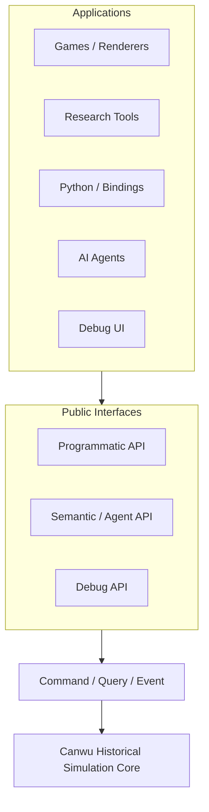
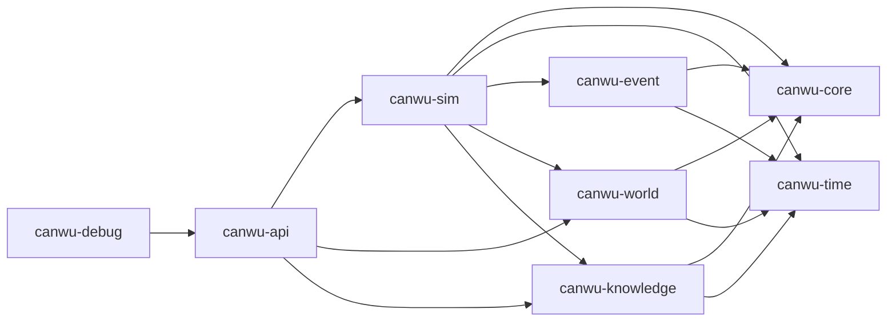
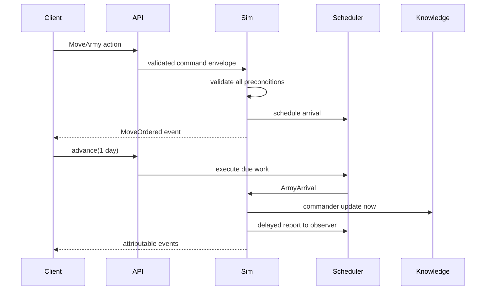

# Canwu Architecture

## Boundary

Applications never receive mutable access to live state. The programmatic API
can request an omniscient snapshot, but that snapshot is detached data. The
semantic API requires an actor and builds observations from that actor's
knowledge records.

## Dependency direction

`canwu-sim` owns the mutable runtime. `canwu-world` contains entity models and
read-only snapshots, not a public mutable world store. This makes the command
boundary a structural property instead of a UI convention.

## World, time, and events

A validated command produces an event and optional scheduled work. Internal
scheduled continuations are ordered by `(simulation timestamp, insertion
sequence)`. Host-facing work uses one persisted ingress queue for commands,
plugin-defined communication/acknowledgement/information packets, and calendar work. Queue
order is `(due time, class, descending priority, issue time, ingress ID)`, with
classes ordered command, communication, acknowledgement, information, then
scheduled system. Late input is rejected rather than inserted behind a
committed boundary. A boundary system may schedule a typed follow-up packet;
even a zero-delay packet becomes eligible only after the current admission cut,
so it settles at a second boundary at the same simulation timestamp instead of
retroactively changing the boundary that created it. New scheduled work must
use representable checked time arithmetic rather than saturation.
`canwu-time` exposes checked hour/day construction and checked time/duration
arithmetic for data-dependent values. Its convenience constructors and
operators never clamp; an out-of-range convenience operation fails loudly.
Initial `Scenario` values currently admit stationary armies only: in-flight
state requires the command, event, correlation, and queue evidence carried by a
runtime snapshot. Scenario admission also rejects non-finite map coordinates so
every accepted state can round-trip through the JSON persistence format.

## Public interfaces

- Programmatic API: typed entity reads, commands, events, time, snapshots,
  forks, world diffs, schemas, and plugin descriptors.
- Query API: serializable entity selection, filters, selected fields, and
  limits for tools and bindings.
- Semantic API: `observe`, `inspect`, `query`, `available_actions`, `act`,
  `explain`, `wait`, and `describe_capabilities`.
- Debug API: omniscient reads plus explicitly debug-authorized commands. The
  reference UI uses the same command dispatcher as every other client.

Repository agent skills live under `agent-interface/`. The `canwu-engine`
plugin teaches external agents to use the public and semantic APIs. The
`canwu-developer` plugin contains contributor and release workflows. These
Codex skill plugins are development interfaces and are separate from runtime
`SimulationPlugin` implementations registered in `canwu-sim`.

## Knowledge model

Ground truth and knowledge are separate stores. An army knowledge record has a
known location, estimated strength range, observation time, learning time,
confidence in permille, and source. Semantic responses use those records and
filter event changes to facts visible to the requesting actor.

## Plugins

Plugins register schema, semantic action metadata, command handlers, legacy
event reactors, and phased boundary systems. Registration is transactional:
duplicate plugin, command, system, schema, state owner, phase writer, or
reservation offerer claims reject the complete plugin registration without
changing the live registry. Immediate handlers use `SystemContract`;
authoritative phased systems use `BoundarySystemContract`, which declares
phase, cadence, reads, writes, reservation offers and requests, later allocation
reads, owned random streams, emitted records, and visibility. Immediate and
phased handlers cannot write the same `StateKey`. Every executable plugin also
declares a package version and a 64-character semantic hash; either value or
any serialized contract mismatch blocks snapshot rehydration and replay.

The runtime enforces declared reads for core collections, plugin components,
and reservation results. It rejects every component write that is undeclared or
targets another owner's `StateKey`. Persisted component identity is the typed
tuple `(plugin, state key, entity, component)`; text separators cannot alias
records. Executable order is always canonical and never depends on plugin
registration order.

Plugins may also register application-defined `DomainRecordSchema` values.
Each schema owns one namespaced `DomainRecordKind`, declares whether instances
are entity identities or non-entity records, validates payload fields, and
defines typed reference roles with cardinality and retired-target rules.
Instances use stable string `DomainRecordRef` identities and can be created,
updated with an expected version, retired with an optional same-kind successor,
or deleted only after retirement. Deletion retains a versioned tombstone so an
identity cannot be silently reused. The kernel validates the complete mutation
bundle, including cross-record references, schema ownership, successor state,
and external live dependencies, before commit. A successor must be active when
the retirement is admitted; later retirement of that successor can extend a
stable, cycle-free succession chain without invalidating earlier links. Domain
record collections are ordered and are queryable through both `Simulation` and
`Canwu`. Scenarios that contain initial domain records must use a plugin-aware
constructor such as `new_with_plugins`; ordinary constructors reject them
instead of returning a half-configured runtime that could emit an unloadable
snapshot.

Domain record state is boundary-only: immediate reactors and commands cannot
write a record kind as an untyped component. Boundary systems declare the
record kind's `StateKey`, propose `MutateRecord` directives, and read current or
invariant-candidate values through `domain_record` and
`proposed_domain_record`. This keeps lifecycle changes inside the same atomic
visibility and rollback contract as other authoritative domain changes.

## Phased settlement boundary

`settle_boundary(BoundaryRequest)` is the authoritative extension path for new
domain mechanics. It transactionally executes internal scheduled continuations
strictly before the requested time, admits and processes due canonical ingress,
then executes equal-time internal scheduled continuations before taking the
immutable boundary snapshot. It visits all fourteen settlement phases in order.
Caller-supplied cadence categories are
canonicalized; event-driven systems are selected when admitted events or
ingress exist. `advance_canonical` and `step_canonical` select the earlier of
internal scheduled work and canonical ingress so hosts cannot step past due
work. Equal-time command ingress is processed before internal scheduled
continuations, preserving the declared command-before-scheduled-system order. A
system that declares `canwu.core.ingress` read access can resolve only the
admitted plugin packets owned by its own plugin; future, command, calendar,
and other-plugin payloads remain unavailable through that view. Systems within a
phase execute by `(plugin name, system name)`. The boundary builds one sparse,
non-iterated admission index from the packets admitted at that boundary, so
repeated lookups neither rescan the queue nor allocate against total history.

The kernel owns ingress, snapshot, ordinary commit, and conditional-transition
commit. Phase-six systems publish resource capacity and competing claims.
Allocation sorts by pool, descending priority, explicit tie-break key, and
reservation identity, then records fulfilled, partial, or rejected results.
Only systems with an explicit `reservation_reads` declaration can consume an
allocation.

Phase-seven changes are staged against the immutable boundary snapshot.
Same-boundary values are exposed through the normal read-only overlay, while
next-boundary values remain hidden from current-state reads until settlement has
finished. Invariant systems can separately inspect every staged candidate with
`proposed_component` or `proposed_domain_record`, still subject to their declared
read set. Ordinary changes commit at phase nine. Historical candidates stage a
separate transition bundle for phase eleven. Strategic aggregation and
perspective/report materialization use the same ownership and visibility rules.
Any fatal error restores time, queues, state, journals, random state, counters,
and boundary records to their pre-boundary values.

Each successful boundary persists its ID, time, correlation, cadence set,
admitted command attempts, accepted commands, admitted and boundary-generated
ingress, and events, reservation evidence, allocations, random draws, field
changes, domain record lifecycle changes, exact producer plugin/system/phase/
visibility provenance, a deterministic state hash, and the previous and current
boundary hashes. Every
committed domain record change has one indexed, causally linked evidence event.
Snapshot loading reconstructs the initial record store from this history,
deterministically reapplies each commit stage, and requires the result to equal
the persisted ordered store. It also reconstructs queued command attempts and
calendar cadences in admission order rather than treating boundary membership as
sufficient evidence. Reservations,
component writes, command authority, and event entities are checked against the
domain identities available to the originating proposal and after its atomic
commit stage, so rehashed evidence cannot consume another system's invisible
same-stage creation or refer to an entity before creation or after deletion.
Declared seat institutions must exist both in manifest-bound genesis and in the
persisted final state.
Boundary-caused events do not invoke
legacy immediate reactors; they enter the next boundary through normal event
admission. Format 4 snapshots validate this evidence and require exact plugin
identity and descriptor rehydration before continuation. Because format-4 state
and boundary commitments include the producing engine version, a format-4 save
from another engine version is rejected until an explicit migration exists.
Boundary-aware replay uses command admission lists to reconstruct operation
order and rejects any regenerated boundary whose complete evidence differs from
the journal.

The hot runtime keeps monotonic attempt, accepted-command, and event admission
cursors. Each settlement reads only the unadmitted journal tails and advances
the cursors after the boundary record commits, so admission work is proportional
to newly admitted evidence instead of all prior boundaries and journals. The
cursors are persisted derived metadata: loading validates them against the
global boundary-prefix proof, legacy snapshots derive them deterministically,
and failed settlement restores them with the rest of the transaction.

Append-only events, commands, command attempts, ingress, boundary records, and
random draws have one internal owner, `RuntimeEvidence`, separate from mutable
world/knowledge/plugin state. Public snapshots and replay journals deliberately
retain their existing flat serialized shapes while this internal boundary is
established; later segmented or checkpoint-plus-journal storage can replace the
owner without spreading evidence mutation back through the runtime.

The remaining runtime bookkeeping is partitioned by responsibility rather than
stored as unrelated fields on the authoritative world container.
`RuntimeCurrentState` owns the mutable core world, actor-relative knowledge,
plugin components, generic domain records, and scoped random-stream positions.
`RuntimeScheduler` owns the committed clock, scheduled actions, and pending
canonical ingress; `RuntimeCounters` owns monotonic identifiers, the
authoritative revision, and boundary-admission cursors; `RuntimeMetadata` owns
the initial scenario binding, run identity, plugin-registration state, replay
revision provenance, and current checkpoint commitment. These owners are
private implementation boundaries. Snapshot and replay formats remain flat,
and accepted-command and settlement transactions still clone every partition
together until their staged replacements land. When an expected rejection is
detected before mutable command application, its evidence transaction is already
narrower: it preflights identifiers and revision, then checkpoints only the
attempt tail, affected counters and registration flag, commitment cache and
roots, and checkpoint hash. A fatal commitment failure restores those fields
without cloning mutable world, scheduler, or unrelated evidence.

Every current snapshot stores commitment format 1 roots for world, knowledge,
plugin components, generic records, scheduler state, commands and attempts,
events, ingress, random state/evidence, the boundary chain, run/plugin identity,
and runtime control counters. Unordered collections are canonicalized by stable
identity before hashing, so roots do not depend on insertion order. Checkpoint
domain `canwu.checkpoint.v4` combines those domain-separated roots with the
exact run-manifest hash and authoritative revision contract. Loading recomputes
and compares every root before accepting the outer checkpoint.

Earlier format-4 snapshots carry commitment format 0. Migration verifies their
checkpoint-v3 full-state commitment first, derives the current roots only from
that verified state, and writes a checkpoint-v4 commitment; it cannot launder a
tampered legacy snapshot. Exact replay journals record their commitment format,
so historical journals can still reproduce checkpoint v3 while current journals
reproduce checkpoint v4. Historical boundary state commitments remain on their
existing contract and are reproduced by exact replay; when a snapshot is exactly
at its boundary head, loading also recomputes and compares that boundary state
commitment directly. Runtime checkpoint refresh keeps cloneable incremental hash
state for append-only commands, attempts, events, ingress, and random draws, and
feeds only newly appended journal tails into those roots. It also retains the
last canonical roots for world, knowledge, plugin components, domain records,
the scheduler, random streams, and run/plugin identity. The private mutation
helpers invalidate the domains they own; settlement remains conservative where
several domains can change together. Runtime control and the combined roots are
cheaply rebuilt at every checkpoint. The cache is cloneable with transaction
state, is restored by rollback, and is never trusted on load: snapshot validation
independently rebuilds every persisted root from serialized evidence before the
runtime cache is reconstructed.

Randomness is available to phased systems only through declared
`RandomStreamKey` values. The kernel derives each stream from the run root seed,
keeps its position independent from unrelated domains, and records every draw
automatically. Draws made by a boundary that later fails disappear with the
rest of that transaction. Core report-delay draws additionally name the exact
recipient, army, dispatch event, and arrival time they produced, and loading
recomputes that time from the recorded value. Validation also requires every
report-dispatch event to have exactly one such draw, so removing both draw and
stream progress cannot preserve an apparently coherent report history.

The legacy immediate command/event path remains for the movement slice and
compatibility examples. It is transactional, but it is not a substitute for the
fourteen-phase boundary and cannot own state also managed by phased systems.
`submit` preserves that direct compatibility path. `process_command` accepts an
owned tracked `CommandRequest` with an idempotency key, expected revision,
expected simulation time, typed issuer, and explicit seat/authority context.
Natural-clock hosts enqueue that request with `enqueue_command` and settle it
through `advance_canonical` or `step_canonical`; plugin packets use
`enqueue_plugin_ingress`, and explicit calendar work uses
`schedule_calendar_boundary`. Accepted and expected-rejected attempts are
persisted, hashed, admitted at a boundary, restored by save/load, and regenerated
by exact replay. Exact retries return the original outcome without new mutation;
request-ID collisions are fail-closed without creating evidence. The persisted
authoritative revision advances exactly once for every accepted command,
persisted expected rejection, and published settlement boundary. Failed
transactions and exact retries do not advance it. Bare clock movement, queued but
unadmitted ingress, and plugin setup do not create a revision transaction;
expected simulation time independently detects clock and scheduled-work
advancement. Declared external commands require both guards. Live requests,
compatibility-only legacy-direct calls, and frozen replay inputs remain distinct;
only exact replay can consume `FrozenReplay`, and declared read-only runs reject
newly authored plugin ingress. Plugin boundary systems can return
`ScheduleIngress` to continue communication pipelines without host orchestration.
Recurring calendar policy and conservation bundles remain later conformance
work.

Command handlers receive an immutable `CommandContext` containing the issuer
asserted by the trusted in-process host, typed decision origin, seat and
permission-profile context, command-relevant run policy, ingress class, command
and attempt identities, request identity, revision, simulation time, and
expected revision/time guards alongside the read-only simulation view. Canwu
does not authenticate a freely constructed `CommandEnvelope`; network, IPC, and
account adapters must authenticate callers before selecting an `Issuer` and
authority context. Handlers return directives and cannot take a mutable world
reference. Directives can update declared components, emit attributable custom
events, or schedule future directives. `CommandPolicyContext` intentionally
omits run purpose, observation, and trace, preventing authoritative handlers
from branching on presentation-only dimensions.

Executable plugin handlers are stateless Rust function pointers. Deterministic
plugin state belongs in serialized, plugin-owned components; hidden mutex,
atomic, cache, counter, or RNG state is not part of the extension contract.
This keeps command rollback, failed-boundary recovery, forks, snapshots, and
replay independent.

Command application, each same-timestamp scheduled batch, and each phased
settlement are transactional. If fallible event or plugin processing fails,
state, time, queues, events, boundary records, random state, and ID counters
return to the last successful transaction or timestamp boundary. Once command
application has begun, its full transaction clone still governs rollback; after
that rollback, any persisted rejection evidence uses the explicit narrow
checkpoint described above. Plugin directives validate every referenced entity
before mutation. Snapshot loading also proves that pending arrivals agree with
army transit, move commands, order events, timestamps, and correlations, and
that pending or completed report delivery agrees with its dispatch and arrival
evidence.

Executable handlers are not serialized. A snapshot stores validated plugin and
system descriptors together with author-declared package versions and semantic
hashes. Continuation is blocked until every required plugin is rehydrated, and
registration must reproduce the exact stored identity and descriptor before
its handlers become active. `RunManifest` separately binds scenario, rules,
content, localization-sensitive contracts, run configuration, and source
provenance. A declared `RunConfigurationSnapshot` carries the six orthogonal CM
policy dimensions and is validated against that manifest. Authoritative state
and boundary hashes normalize admission and presentation policy so changing
only observation or trace policy cannot change simulation-result identity or
RNG state. The checkpoint remains a save-container commitment and additionally
binds the exact full run-manifest hash, so differently authorized or observable
runs cannot masquerade as the same save even when their simulated state is
identical. Use
`ReplayJournal` and `replay_from_journal` for exact replay: the journal freezes
engine and snapshot versions, root seed, run manifest, run configuration,
plugin descriptors, the plugin-registration lifecycle state, accepted commands,
accepted/rejected command attempts, boundaries, final time, and final checkpoint
hash plus the final authoritative revision before executing anything. The older
`replay*` helpers reconstruct caller-supplied fixtures but do not claim
recorded-environment verification. Automatic package discovery remains later
work. Revision-format-0 snapshots can migrate and continue, but retain
migration-only replay provenance because snapshot-only migration cannot rebuild
every historical boundary state commitment. They therefore cannot export a
journal that claims current exact replay. New plugin
registration closes after the first recorded tracked attempt (accepted or
expected-rejected), successful compatibility command, time advance, or phased
settlement; exact snapshot rehydration remains allowed after that point.
Snapshots retain the run's initial time and reject a
registration-open flag when commands, events, queued work, component state,
counter movement, or elapsed simulation time proves execution already began.
Format 2 and 3 checkpoints without plugins can continue after explicit
migration with identity-unbound legacy provenance. Exact replay is rejected
with `legacy_replay_unavailable`, because those formats did not retain enough
environment identity or state commitments to make that claim safely. Earlier
format-4 saves that retained a custom run-configuration artifact but not the
six policy dimensions hydrate as `ManifestOnlyV1`; their recorded manifest and
exact replay remain valid without fabricating modern policy semantics.

## External renderer integration

Renderers consume snapshots and events: territory points, route endpoints, army
locations, relationships, movement events, and knowledge views. A renderer may
turn them into sprites, meshes, SVG, ASCII, or tables. None of those concepts
enter Canwu's state model.

## Portability and versions

The headless crates use portable Rust APIs and support Windows, macOS, and Linux.
Operating-system window-system features are confined to `canwu-debug`; Linux
enables Wayland and X11 while Windows and macOS use their native `eframe`
integration. CI verifies all three targets.

All first-party crates share one SemVer version from the workspace manifest.
Persistent snapshots additionally carry an independent format version so engine
releases and storage migrations do not have to move in lockstep.

## Celestial Mandate conformance

Canwu's first complete external-engine target is the reusable engine boundary
required by Celestial Mandate. The normative engine-neutral capability profile
is maintained in [`cm-engine-conformance.md`](cm-engine-conformance.md).

That profile does not move Celestial Mandate rules into Canwu. Instead, it
requires Canwu to provide the deterministic settlement, authority, ownership,
transaction, knowledge, persistence, lineage, package, and publication
contracts through public extension points. The current v0.4 runtime adds scoped
randomness, run/plugin identity, boundary hash evidence, typed run policy,
replayable authority-aware requests, and a canonical
command/communication/calendar ingress journal to the v0.3 phased settlement
foundation. It is still only a partial conformance result; the remaining gaps
are tracked in the profile itself.
