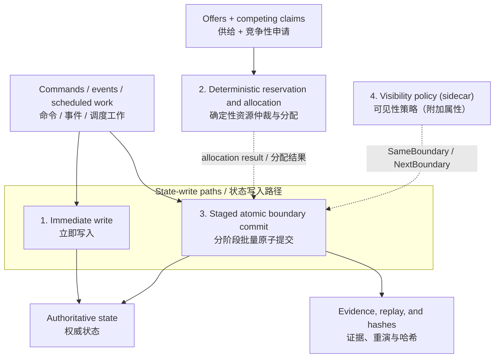
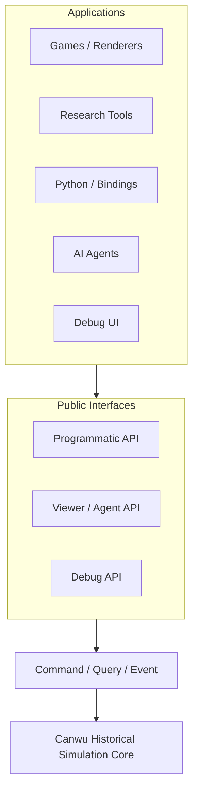
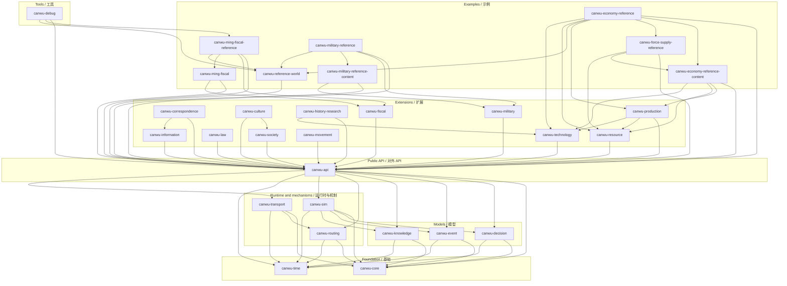
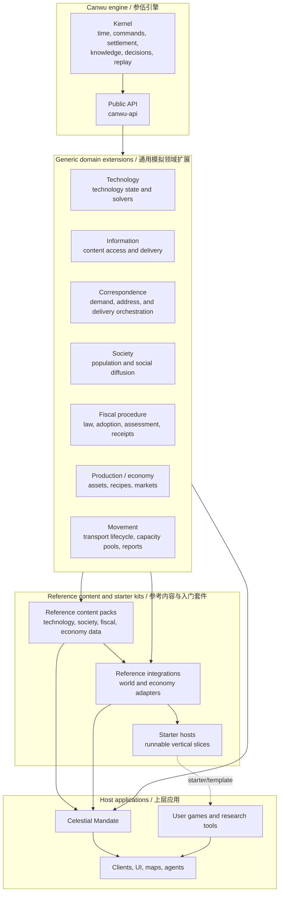
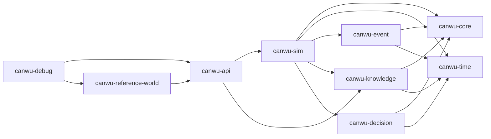
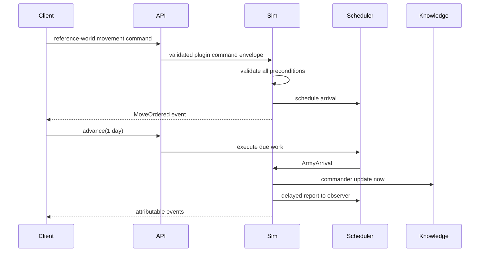

# Canwu Architecture

## Settlement foundations / 结算系统底层构成

Canwu exposes fourteen ordered settlement phases, but those phases are not
fourteen independent algorithms. At the lowest level, the runtime combines two
state-write paths, one deterministic allocation primitive, and one
cross-cutting visibility policy:


```mermaid
flowchart TB
    Inputs["Commands / events / scheduled work<br/>命令 / 事件 / 调度工作"]
    Claims["Offers + competing claims<br/>供给 + 竞争性申请"]

    subgraph Writes["State-write paths / 状态写入路径"]
        Immediate["1. Immediate write<br/>立即写入"]
        Boundary["3. Staged atomic boundary commit<br/>分阶段批量原子提交"]
    end

    Allocation["2. Deterministic reservation and allocation<br/>确定性资源仲裁与分配"]
    Visibility["4. Visibility policy (sidecar)<br/>可见性策略（附加属性）"]
    State["Authoritative state<br/>权威状态"]
    Evidence["Evidence, replay, and hashes<br/>证据、重演与哈希"]

    Inputs --> Immediate
    Inputs --> Boundary
    Claims --> Allocation
    Allocation -. "allocation result / 分配结果" .-> Boundary
    Visibility -. "SameBoundary / NextBoundary" .-> Boundary
    Immediate --> State
    Boundary --> State
    Boundary --> Evidence
```

### English

1. **Immediate write** is the direct command/event path. The operation applies
   atomically on its own, without staging for a boundary commit, and either
   commits completely or rolls back completely. It remains the compatibility
   path for the existing movement slice and legacy event reactors. Synchronous
   reactors are therefore compatibility-only: nested event re-entry is bounded
   by `MAX_SYNCHRONOUS_REACTION_DEPTH`, and a limit breach rolls back the
   enclosing command or event application. New mechanics should use phased
   boundary systems, which collect proposals before one deterministic commit.
2. **Deterministic reservation and allocation** is a calculation primitive, not
   a state-write path. Systems publish capacity and competing claims; the
   kernel sorts them by pool, descending priority, explicit tie-break key, and
   reservation identity, then records a fulfilled, partial, or rejected result.
3. **Staged atomic boundary commit** is the authoritative batch-write path for
   new domain mechanics. Systems propose changes against one immutable boundary
   snapshot; the kernel validates the combined proposal and commits it as an
   atomic bundle, or restores the entire boundary on failure. Allocation results
   often feed this step, but it can also commit changes that do not use
   reservations.
4. **Visibility policy** is not a fourth settlement algorithm. It is a
   cross-cutting attribute attached to staged writes: `SameBoundary` exposes a
   value to later systems in the current boundary, while `NextBoundary` keeps it
   out of current-state reads until the boundary has finished. In other words,
   it is a sidecar-like policy on the staged commit path, not an independent
   writer or solver.

The practical classification is therefore: **1 and 3 are write mechanisms; 2
computes a result; 4 controls when a staged result becomes readable**. The
fourteen phases provide ordering, validation, evidence, and replay around these
foundations rather than introducing fourteen separate settlement models.

### 中文

1. **立即写入**是命令或事件的直接处理路径。操作不经过边界的暂存与提交，
   单独原子执行，要么完整提交，要么完整回滚。它仍是既有移动逻辑和旧式事件
   reactor 的兼容路径。
   因此，同步 reactor 只保留为兼容能力：嵌套事件重入受
   `MAX_SYNCHRONOUS_REACTION_DEPTH` 限制，超过限制会回滚整个外层命令或
   事件处理。
   新机制应使用分阶段 boundary system，先收集提案，再统一确定性提交。
2. **确定性资源仲裁与分配**是一种计算原语，不是状态写入路径。系统先
   发布资源容量和竞争性申请；内核再按资源池、优先级（降序）、显式
   tie-break 键和 reservation identity（预留标识）进行排序，得出“满足、部分
   满足或拒绝”的分配结果。
3. **分阶段批量原子提交**是新领域机制使用的权威批量写入路径。各系统
   基于同一份不可变边界快照提出变更；内核统一校验整组提案，然后
   作为一个原子批次提交。任何致命错误都会恢复整个边界。资源分配结果
   经常在这里落地，但没有资源仲裁的变更也可以直接使用这条路径。
4. **可见性策略**不是第四种独立的结算算法，而是附着在分阶段写入上的
   横切属性：`SameBoundary` 让当前边界后续阶段可以读取结果；
   `NextBoundary` 则把结果隔离到本边界结束之后，下一边界才能从当前状态
   读到。也就是说，它类似 sidecar 的策略元数据，而不是独立的写入器或
   求解器。

因此最实用的分类是：**1 和 3 负责写入；2 负责计算分配结果；4 负责控制
   分阶段结果何时可读**。十四个阶段负责把这些底层机制组织成确定的顺序、
   校验、证据和重演流程，而不是提供十四种彼此独立的结算算法。

## Format 8 contract / Format 8 契约

Before 1.0, Canwu uses a clean persistence break. Format 8 requires a declared
run manifest, a declared or `CompatibilityV1` run configuration (the plain
constructors write `CompatibilityV1`), canonical initial scenario, versioned
commitments, content-addressed state-page envelopes, and a self-contained replay
journal. The engine does not load or silently migrate pre-8 saves.
`SimulationGranularity` supplies the generic
`aggregate` / `group` / `actor` levels; Population, Special Group, and Character
are Celestial Mandate mappings owned by a downstream reference integration.
Southern Ming and WWII content therefore does not belong in Canwu core.

## Boundary


```mermaid
flowchart TB
    subgraph Applications
        Games[Games / Renderers]
        Research[Research Tools]
        Python[Python / Bindings]
        Agents[AI Agents]
        Debug[Debug UI]
    end
    subgraph Public[Public Interfaces]
        Programmatic[Programmatic API]
        Viewer[Viewer / Agent API]
        DebugApi[Debug API]
    end
    CQE[Command / Query / Event]
    Core[Canwu Historical Simulation Core]

    Applications --> Public
    Public --> CQE
    CQE --> Core
```

Applications never receive mutable access to live state. The programmatic API
can request generic authoritative records and evidence as detached data. The
viewer API binds an actor or institution and queries only that holder's
knowledge records. Concrete world projections belong to domain integrations.

## Workspace crate dependency DAG / 工作区 crate 依赖 DAG

The graph shows normal, direct dependencies between first-party workspace
crates. An arrow from A to B means **A depends on B**; external and development
dependencies are omitted. / 下图只展示第一方工作区 crate 之间的普通直接依赖。
A 指向 B 表示 **A 依赖 B**；外部依赖和开发依赖未列入。


```mermaid
flowchart TB
    subgraph Tools["Tools / 工具"]
        Debug["canwu-debug"]
    end

    subgraph Extensions["Extensions / 扩展"]
        Correspondence["canwu-correspondence"]
        Information["canwu-information"]
        Society["canwu-society"]
        Culture["canwu-culture"]
        Law["canwu-law"]
        Technology["canwu-technology"]
        History["canwu-history-research"]
        Fiscal["canwu-fiscal"]
        Resource["canwu-resource"]
        Production["canwu-production"]
        Military["canwu-military"]
        Movement["canwu-movement"]
    end

    subgraph Examples["Examples / 示例"]
        MingFiscal["canwu-ming-fiscal"]
        EconomyContent["canwu-economy-reference-content"]
        MingReference["canwu-ming-fiscal-reference"]
        ForceSupply["canwu-force-supply-reference"]
        EconomyReference["canwu-economy-reference"]
        ReferenceWorld["canwu-reference-world"]
        MilitaryContent["canwu-military-reference-content"]
        MilitaryReference["canwu-military-reference"]
    end

    subgraph PublicApi["Public API / 对外 API"]
        Api["canwu-api"]
    end

    subgraph RuntimeMechanisms["Runtime and mechanisms / 运行时与机制"]
        Sim["canwu-sim"]
        Transport["canwu-transport"]
        Routing["canwu-routing"]
    end

    subgraph Models["Models / 模型"]
        Decision["canwu-decision"]
        Event["canwu-event"]
        Knowledge["canwu-knowledge"]
    end

    subgraph Foundation["Foundation / 基础"]
        Core["canwu-core"]
        Time["canwu-time"]
    end

    Debug --> Api
    Debug --> MingReference
    Correspondence --> Api
    Correspondence --> Information
    Information --> Api
    Society --> Api
    Culture --> Society
    Culture --> Api
    Law --> Api
    Technology --> Api
    History --> Api
    History --> Technology
    Fiscal --> Api
    Resource --> Api
    Production --> Api
    Production --> Resource
    Production --> Technology
    Military --> Api
    Movement --> Api
    MingFiscal --> Api
    MingFiscal --> Fiscal
    EconomyContent --> Api
    EconomyContent --> Production
    EconomyContent --> Resource
    EconomyContent --> Technology
    MingReference --> Api
    MingReference --> Fiscal
    MingReference --> MingFiscal
    MingReference --> ReferenceWorld
    ForceSupply --> Api
    ForceSupply --> EconomyContent
    ForceSupply --> Resource
    EconomyReference --> Api
    EconomyReference --> EconomyContent
    EconomyReference --> ForceSupply
    EconomyReference --> Production
    EconomyReference --> ReferenceWorld
    EconomyReference --> Resource
    EconomyReference --> Technology
    MilitaryContent --> Api
    MilitaryContent --> Military
    MilitaryReference --> Api
    MilitaryReference --> Military
    MilitaryReference --> MilitaryContent
    MilitaryReference --> ReferenceWorld

    Api --> Core
    Api --> Decision
    Api --> Event
    Api --> Knowledge
    Api --> Routing
    Api --> Sim
    Api --> Time
    Api --> Transport
    ReferenceWorld --> Api
    Debug --> ReferenceWorld

    Sim --> Core
    Sim --> Decision
    Sim --> Event
    Sim --> Knowledge
    Sim --> Time

    Transport --> Core
    Transport --> Routing
    Transport --> Time

    Routing --> Core
    Routing --> Time

    Decision --> Core
    Decision --> Time
    Event --> Core
    Event --> Time
    Knowledge --> Core
    Knowledge --> Time
```

## Architecture layers / 架构分层

Canwu is intentionally useful at more than one level. The engine supplies
deterministic simulation contracts; domain extensions supply reusable mechanics;
reference kits supply runnable defaults; and host applications decide which
world, content, presentation, and product rules to compose. The lower layers do
not depend on the historical content of the upper layers.


```mermaid
flowchart TB
    subgraph Engine["Canwu engine / 参伍引擎"]
        Core["Kernel<br/>time, commands, settlement,<br/>knowledge, decisions, replay"]
        Api["Public API<br/>canwu-api"]
        Core --> Api
    end

    subgraph Domains["Generic domain extensions / 通用模拟领域扩展"]
        Tech["Technology<br/>technology state and solvers"]
        Info["Information<br/>content access and delivery"]
        Correspondence["Correspondence<br/>demand, address, and delivery orchestration"]
        Society["Society<br/>population and social diffusion"]
        Fiscal["Fiscal procedure<br/>law, adoption, assessment, receipts"]
        Production["Production / economy<br/>assets, recipes, markets"]
        Movement["Movement<br/>transport lifecycle, capacity pools, reports"]
    end

    subgraph Kits["Reference content and starter kits / 参考内容与入门套件"]
        Packs["Reference content packs<br/>technology, society, fiscal, economy data"]
        Integrations["Reference integrations<br/>world and economy adapters"]
        Starters["Starter hosts<br/>runnable vertical slices"]
        Packs --> Integrations
        Integrations --> Starters
    end

    subgraph Apps["Host applications / 上层应用"]
        CM["Celestial Mandate"]
        UserGames["User games and research tools"]
        Clients["Clients, UI, maps, agents"]
        CM --> Clients
        UserGames --> Clients
    end

    Api --> Domains
    Domains --> Packs
    Domains --> Integrations
    Starters -. "starter/template" .-> UserGames
    Packs --> CM
    Integrations --> CM
    Domains --> CM
```

The arrows describe dependency and composition, not ownership of all the state
below them. A reference content pack is data consumed by a domain extension. A
reference integration is executable domain or host code that maps generic
capabilities to a small, inspectable world model. A starter host is a complete
consumer that demonstrates the composition without becoming part of the
kernel.

This classification prevents two opposite mistakes: putting historical or
opinionated examples into `canwu-core`, and leaving new users with only low-level
contracts and no working model to extend.

## Dependency direction


```mermaid
flowchart LR
    core[canwu-core]
    time[canwu-time]
    event[canwu-event]
    reference_world[canwu-reference-world]
    knowledge[canwu-knowledge]
    decision[canwu-decision]
    sim[canwu-sim]
    api[canwu-api]
    debug[canwu-debug]

    event --> core
    event --> time
    knowledge --> core
    knowledge --> time
    decision --> core
    decision --> time
    sim --> core
    sim --> time
    sim --> event
    sim --> knowledge
    sim --> decision
    api --> sim
    reference_world --> api
    api --> knowledge
    debug --> api
    debug --> reference_world
```

`canwu-sim` owns the mutable runtime. `canwu-reference-world` owns the example
entities and detached projection through typed domain records and plugin
commands. This makes the command boundary a structural property instead of a
UI convention.

### World and event model ownership / 世界与事件模型所有权

The dependency DAG above describes the current implementation, not the target
ownership of every public type. The accepted
[world and event ownership audit](proposals/world-event-ownership-audit.md)
establishes this invariant: generic engine crates own deterministic simulation
contracts, while reference integrations own period- and application-specific
world entities and event payloads. / 上面的依赖 DAG 描述当前实现，并不代表每个
公开类型的最终归属。已经接受的审计确立同一条边界：通用引擎 crate 拥有确定性
模拟契约，参考整合包拥有时代或应用特定的世界实体和事件载荷。

That ownership split is now complete: `canwu-reference-world` owns the model,
movement behavior, detached projection, and routing adapter; the source
`canwu-world` package has been retired from the workspace and dependency DAG.
The remaining `WorldSnapshot` projection is a current reference/runtime API,
not a persistence migration surface. Format 8 does not load old saves.
`canwu-event` now contains only generic contracts: `EventKind` is a type label
plus flattened structured fields, while concrete movement, arrival, letter,
report, knowledge, and debug payload structs live outside that crate. / 按此
方向，这项迁移已经完成：`canwu-reference-world` 拥有模型、移动行为、脱离式
投影和路由适配器；`canwu-world` 源码包已从 workspace 与依赖 DAG 退役。
当前 `WorldSnapshot` 只作为参考整合与运行时投影保留；Format 8 不加载旧存档。
`canwu-event` 现在只包含通用契约：`EventKind` 由类型标签和扁平化结构
字段组成，具体移动、到达、信件、报告、知识和调试载荷结构均位于该 crate 之外。

The event extraction is a Rust source-API break: callers replace enum
construction and exhaustive matching with `from_payload`, `event_type`,
`is_type`, and typed field/payload decoding. Format 8 also fixes canonical
field ordering and commitment versions; pre-8 snapshots and journals
are rejected rather than migrated. / 事件迁出会破坏 Rust 源 API：调用方需以通用
构造、类型标签和强类型字段或载荷解码替代枚举构造与穷举匹配。Format 8 同时固定
规范字段顺序并提升承诺版本；Format 8 以前的快照和日志会被拒绝，不在内核中迁移。

## Decision framework

`canwu-decision` is the official headless decision SDK. It defines persisted
decision tickets, versioned dynamic options, controller bindings, persisted
decision attempts and traces, a reusable weighted utility evaluator, policy
contracts for the `Utility`, `Rule`, `Human`, `External`, and `Llm` policy kinds
(`DecisionPolicyKind`), the `Random` kind that a boundary draw resolves, and a
guarded utility policy that composes rules, utility, and a bounded random
tie-break. Domain packages still define when a decision exists, what its
context means, which options are legal, and which domain command an option
represents.

The authoritative flow is:

```text
actor-relative facts -> DecisionTicket -> policy selects an existing option ID
    -> canonical decision ingress -> DecisionAttempt -> DecisionTrace
    -> validated command ingress
```

Policies do not receive mutable simulation state or command authority. A local
policy evaluates the explicit ticket projection and can select only an option
already present on that ticket. External and LLM adapters serialize an even
narrower request containing context and available option descriptors but no
authoritative action payload. Human, External, and LLM responses bind the
ticket version, so a response computed before `ReplaceOptions` is rejected as
stale. The controller binding, not the policy, derives command issuer, decision
origin, seat, permission profile, and command subject. Normal command admission
then validates that derived authority before any command mutation. A command
handler can also require `CommandContext::decision_controller_id`; the engine
sets it only for the nested command of validated decision ingress, so callers
cannot manufacture DecisionTicket provenance with `CommandEnvelope::with_authority`.

Random selection stays inside the boundary. A declared boundary
system uses `random_sample_for_operation` with
`RandomOperationTarget::DecisionTicket`, supplies canonical
`DecisionOptionWeight` values through `ResolveDecisionRandomly`, and lets the
kernel generate the canonical resolution ingress for the next eligible
boundary. `DecisionTrace.random` and `RandomDrawRecord` cross-reference the
ticket version, selected option, draw value, bound, producer, and purpose. A
failed boundary rolls back both the generated ingress and the random stream.
Each source boundary may generate at most one such resolution, due immediately
for the next eligible boundary, so its global revision guard remains
unambiguous.
This is a selector for a bounded ticket, not a replacement for a stochastic
world-event mechanic; discrete incidents still belong to their owning boundary
system, and unknown facts remain unknown rather than being randomized.

`GuardedUtilityPolicy` composes the local selectors. Its ordered guard rules
return `RuleChoice::Select`, `Defer`, `Exclude`, or `NoMatch`; the first select
or defer decides at the `Guard` stage, while `Exclude` removes one option,
records `excluded by <guard>: <reason>` as its blocker, and continues. A later
rule that selects an excluded option is an error, including in
`OrderedRulePolicy`. The remaining options are scored by the weighted utility
evaluator. When `random_tie_break` is set and at least two options score within
the `u64` near-equivalence margin of the best score, the policy returns
`DecisionOutcome::PendingRandom` with exactly those candidates, weight 1 each in
option-ID order; otherwise the best score wins and equal scores fall back to the
lowest option ID. A pending tie-break is never an authoritative resolution. A
boundary system resolves it with the same `ResolveDecisionRandomly` directive,
passing the pending decision as the resolution's `tie_break`, and the draw
covers only those candidates. The controller binding must opt in with
`with_random_tie_break`, which only utility-policy controllers may do. Traces
record the `DecisionStage` (`Guard`, `Utility`, or `Random`) and the guard IDs
that fired. The policy identity reuses `DecisionPolicyKind::Utility` and carries
a BLAKE3 `semantic_hash` over the guard policy identity, guard IDs, utility
weights, margin, and tie-break flag, so a binding rejects a reconfigured policy
that keeps its ID and version with `PolicyMismatch`. Guard behavior itself is
application code outside that hash; change a guard ID or the guard policy
version when it changes.

Draw evidence can come only from a boundary resolution. Host-authored decision
ingress that carries draw evidence is rejected live and during snapshot
validation, for random-policy controllers and tie-breaks alike. A
`ResolveDecisionRandomly` directive also fails its boundary before any draw is
committed when the ticket's person decision maker (`DecisionMakerUnavailable`)
or its controller's authority person (`IssuerUnavailable`) is unavailable in the
person availability committed before that boundary. An availability change
staged earlier in the same boundary does not fail the directive, because
failing would roll the change back and repeat it on every retry; the draw
commits, the end-of-boundary sweep cancels the ticket, and the generated
resolution is rejected at admission. Tie-break and random-policy systems should
therefore skip such tickets, read through `SimulationView::person_availability`.

Registration, opening, option replacement, resolution, and cancellation enter
the runtime through `DecisionIngressRequest`. They use request IDs, revision
guards, deterministic queue order, atomic boundary settlement, and exact-retry
semantics. A selected command option carries a serialized existing Canwu
command; it must exactly match the nested command request admitted with the
resolution. Decisions cannot bypass the command boundary or invent a new
authority envelope.

Admission also consults core person availability. `Open` records an expected
`DecisionMakerUnavailable` rejection when the ticket's person decision maker is
unavailable, and then an `IssuerUnavailable` rejection when its assigned
controller's authority person is unavailable, so a ticket is never opened for a
controller that could not resolve it. `Resolve` records `IssuerUnavailable`
when the controller's authority person is unavailable. The authority person is
the actor of `DecisionAuthority::Actor` or the responsible actor of
`DecisionAuthority::Institution`; council and no-responsible-actor authorities
are unaffected. Host preparation through `prepare_decision` and
`drive_decision` applies the same two checks before evaluating a policy.

`DecisionTicketDraft::parent_ticket` records decision lineage. At `Open` the
parent must be a terminal ticket in hot decision history with exactly the same
`decision_maker`, or with an assigned controller bound to the same non-empty
`DecisionControllerBinding::seat_id` as the new ticket's controller (a seat
succession); an archived or absent parent is rejected as `TicketNotFound`,
and an open parent or another maker and seat as `InvalidDecision`. The parent is copied
onto `DecisionTicket` and `DecisionTrace`. A ticket cannot be reassigned to
another controller, so a decision whose controller can no longer act continues
as a new ticket for an available controller that names the cancelled ticket as
its parent.

Decision state is authoritative persisted state. Snapshots retain controller
bindings, tickets, deadlines, versions, admission attempts, and traces; loading
validates entity identities and reconstructs accepted and rejected outcomes from
admitted decision ingress. A `Deferred` resolution records a trace and bumps the
ticket version but leaves the ticket open under its original deadline, so live,
restored, and replayed runs expire it at the same boundary. Revision,
ticket-version, closed-ticket, and similar expected conflicts become persisted
rejected attempts, so one bad request cannot poison the canonical ingress queue.
Decision and nested command request IDs are nonzero and globally
collision-checked before persistence. Decision state has its own optional
commitment root. Exact replay replays recorded decision ingress and verifies the
resulting attempts, state, and traces; it deliberately does not rerun a possibly
external, human, or nondeterministic policy. The recorded draw and generated
decision ingress are the replay inputs for Random policy.

### Deterministic outcomes, reloads, and forks

Deterministic replay is not an anti-save-scumming policy. Canwu guarantees that
the same authoritative state, command or decision ingress, plugin semantic
environment, and simulation-time inputs produce the same random draws and
outcomes. Reloading a snapshot before an already admitted event therefore does
not reroll that event. A host may still expose `fork()` or another branch
workflow so a player, AI planner, or researcher can try a different command;
that is a new causal branch, not a replay of the original run.

Whether a product permits manual save branches, exposes only one write-through
save, or offers research-only forks belongs to the host application's save
policy. The engine persists enough state for all three policies but does not
silently convert deterministic replay into irreversible play.

## Simulation domain extensions / 模拟领域扩展

Canwu calls an optional domain-specific module built on the public engine
contracts a **domain extension** (**模拟领域扩展**). A domain extension owns its
domain state, rules, commands, and actor projections while reusing kernel
infrastructure such as events, settlement, decisions, persistence, and replay.

`canwu-correspondence` is a published correspondence domain
extension. It is also a runtime `SimulationPlugin`: the first term describes
ownership of reusable communication policy and evidence, while the second
describes how its authoritative commands and boundary systems execute. It
depends on `canwu-api` and `canwu-information`; neither dependency points back
to it.

`canwu-information` owns the neutral information lifecycle. An
interpretation's `InterpretationPayload` may carry an `AuthenticityFinding`:
the interpreting holder's judgment of whether a
representation's claimed source is accepted, with a basis of at most
`MAX_AUTHENTICITY_BASIS_BYTES` and a per-mille confidence. The finding must cite
one of the interpreted representations at its exact current version, and that
representation must carry a claimed source; otherwise the operation is rejected
as `invalid_lifecycle`. Whether a forgery is detected, and with what
probability, stays an application draw; the extension records only the
finding. `validate_delegation_claim` is domain-neutral and takes the time to
check as `at`.

`canwu-society` is a published **social diffusion simulation
module** (**社会传播模拟模块**). It is a domain extension built on
`canwu-api`, not a dependency of `canwu-api` or a new kernel subsystem. It
models the reusable part of population-scale belief and affiliation change without introducing
religion-specific types into Canwu core.

Its authoritative root record contains ordered, sparse state for:

- cohorts with integer headcounts and application-defined classifications;
- active cohort/affiliation disposition distributions across separate
  awareness, private assent, practice, public alignment, organization tie,
  mobilization, and visibility dimensions;
- social influence edges and bounded organization topology;
- institutional alignments and orthogonal policy pressures;
- stable integer transition remainders, aggregates, mobilization candidates,
  and authorized observer estimates.

Daily transition rules execute in canonical key order with integer rates and
persisted per-rule remainders. Every active cohort/target distribution must
conserve the cohort headcount. Missing pairs are materialized only when a rule
actually addresses them, so runtime state grows with active relationships and
edges rather than a dense territory/cohort/target/channel product.

The social diffusion simulation module deliberately separates this chain:

```text
information exposure != awareness != private assent != public alignment
    != organization tie != mobilization candidate != political conflict
```

Institutional choices use ordinary `DecisionTicket` controllers and a
validated plugin command. The command records a pending policy component; the
next social boundary applies it to institutional alignment before proposing
population transitions. A ruler or policy therefore cannot directly set a
population belief percentage. Phase 10 produces mobilization candidates only;
downstream political or conflict packages decide what, if anything, follows.

A `PolicyPressure` may record its provenance: an optional `issuer` (a
government, organization, or person, bound into the record's core references)
and a `decision_version`, which requires an issuer when non-zero. Both fields
are omitted when unused. Two canonical ingress types reach the society owner
through one queue. The public `cohort_headcount_rebase_v1` packet
(`CohortHeadcountRebaseV1` with a `RebaseReason`) rebases a cohort to an
external conserved stock: the cited stock must be a record outside
`canwu.society`, or the rebase is rejected as `invalid_external_stock`, and it
must be that record's current version when the packet is admitted, or the rebase
is rejected as `stale_external_stock`. The internal `society_lifecycle_delta_v1`
packet (`SocietyLifecycleDeltaV1`) carries a lifecycle provider's target-scoped
rule, alignment, and release changes, one packet per target, for example from
the culture boundary plugin. The event-driven phase-12 system
`intake-society-ingress` queues admitted packets in the
`canwu.society:ingress-queue` record, because the society writer runs only on
Daily boundaries and only one system may write the state in a phase. The next
Daily phase-7 settlement applies the queue after cohort transfers and before
institutional decisions and transitions, and records each outcome in the cohort
exchange ledger (`rebases`, `lifecycle_deltas`). A rebase re-proportions every
distribution of the cohort with integer largest-remainder allocation, so each
distribution totals the new headcount and every bucket stays within one unit of
its exact share. Only the intake writes the queue: an initial scenario that
seeds a non-empty queue is refused with `InvalidAuthority`, and the module-level
restore check (`from_society_snapshot_json` or `validate_society_runtime`)
re-derives a restored snapshot's queued packets from the ingress journal, which
must match the packets admitted at their recorded boundaries. The society plugin
remains the only writer of `canwu.society:state`.

Applying a cohort transfer invalidates the derived aggregates, mobilization
candidates, and projections it affects, and the transfer digest binds only the
state the transfer depends on.

Actor-facing queries require a valid `ViewerContext` and return only a
previously materialized projection for that actor. Absence is an authorization
error, never a request to decode the authoritative society record. Generic
snapshot validation checks the plugin manifest, record schema, commitments,
and referenced core-entity existence. The module-level
`from_society_snapshot_json` boundary additionally recomputes the society
payload-to-reference binding and every persisted aggregate, mobilization
candidate, actor projection, and pending institutional-policy component before
the restored simulation is returned. Optional materialization timestamps keep
`SimTime::EPOCH` and negative simulation times available as real boundary
times. Fork and exact replay use the same serialized authoritative state.

The culture authoring layer and downstream legal institutionalization extension
are specified together in the [culture and legal institutional systems](architecture-culture-law.md).
That design covers authored definitions, deterministic compilation, dirty-set
settlement, Active/Dormant/Retired lifecycle, bounded cultural signal batches,
controller-mediated legal procedure, versioned law records, authority,
visibility, persistence, and exact replay. The detailed implementation proposals
remain [culture authoring SDK and lifecycle design](proposals/culture-authoring-sdk-and-lifecycle.md)
and [legal institutionalization framework](proposals/legal-institutionalization-framework.md).

The `canwu-law` crate implements that legal boundary. Its compiled plan,
directory, order/jurisdiction shards, coordinator, culture-dependency records,
and archive heads are independently versioned. Typed `LegalMutation` ingress,
holder context, expected host-record versions, and decision outcomes are
revalidated inside the plugin boundary before one kernel-atomic domain-record
mutation bundle. The decision outbox uses a durable
prepare/decision/ACK protocol whose ACK proves accepted controller and ticket
outcomes, so ingress archival does not invalidate recovery. Persistent dirty,
deadline, scheduled-version, live-culture-dependency, participation, outbox,
and applicability indexes keep ordinary settlement proportional to due or
changed work rather than immutable history.

Procedure stages tally integer vote weights, can require a
number of unit blocks in the `For` position with a `status-quo` or
`casting-seat:<seat>` tie-break, and can be advisory `Consultation` stages whose
ballots never count and which complete at their deadline. A stage that stops
accepting ballots expires its pending seat work, and a late seat response is
recorded as a rejected outcome instead of failing the plugin boundary. The
[culture and legal institutional systems](architecture-culture-law.md#weighted-unit-block-and-consultation-stages)
page specifies the tally, compile checks, and consultation rules.

### Technology and historical research / 技术与历史研究

`canwu-technology` is a published domain extension built only
on `canwu-api`. It owns generic metric schemas, immutable technique revisions,
program intent, experiment and production evidence, holder/site capability,
installed implementations, use-specific adoption, and transmission
opportunities. It does not own a global technology tree, era levels, research
points, inventory, markets, information artifacts, transport, or historical
case labels.

The reference evaluator applies bounded integer thresholds and alternative
requirement groups. It returns criterion evidence rather than an `invented`
flag. An experiment can succeed without creating qualification; qualification
can exist without installation; installation can exist without use-specific
adoption; a transmission opportunity never grants knowledge or capability by
itself. Qualifications declare `valid_from` / optional `valid_until`,
implementations declare `installed_at`, and practice transmission records the
exact qualification or implementation that made the source capable when the
opportunity opened, or instead an external source (manifest-bound content
evidence with a declared reliability) for an off-map teacher that has no live
capability record. This permits historical entry without allowing a later
installation to justify an earlier transmission. At creation, that exact
source must also be the current version in the boundary's replayed state; later
deactivation blocks new transmission without invalidating prior opportunities.
After creation, the opportunity may only transition from active to closed; a
restart requires a new opportunity citing a then-current source. An
implementation's exact qualification is installation-time evidence, so a later
qualification version does not implicitly stop the installed asset; games must
stop the implementation itself to prevent it from serving as a new transmission
source. Deliberate
changes use tracked plugin commands, while resolved provider results and passive
observations enter through a separate declared ingress. Program provider
requirements are checked when a result is submitted, so intent creation may
produce a pending intent whose eventual provider result is rejected.

Dependencies whose meaning relies on a mutable domain-record body use an exact
`DomainRecordVersionRef`. The trusted host and declared plugin views can resolve
the retained body for that exact version, so a later update cannot reinterpret
older evidence. Generic `EvidenceRef` citations validate retained identity and
existence only; they do not by themselves establish relevance or historical
truth. A compacted receipt still proves existence, but its body and
`evidence_time` require retained or archive-provided content. A record's current
version is the exception: its live record and runtime provenance index keep
both after the establishing boundary is sealed, so a compact run resolves it
exactly as its replay does.
Module-owned restore wrappers re-run technology semantics after normal core
snapshot, checkpoint, or replay validation.

Historical fidelity is downstream and optional. `canwu-history-research`
provides separately selectable source, practice, and production-archaeology
plugins. They create bounded, append-only records of an assessor's method,
date, uncertainty, citations, contradictions, and supersession. They never
replace authoritative attempts, assets, production runs, capability, or
adoption. Omitting them leaves base technology outcomes unchanged and avoids
their record and handler cost.

### Resources, production, and force supply / 资源、生产与军事补给

`canwu-resource` is the shared conserved-quantity boundary. It owns revisioned
resource and unit definitions, accounts, demands, reservations, exact
allocation legs, transfers, consumption, losses, fulfillment, and operation
receipts. Protected floors, custody, acceptance, explicit conversions, and
holder-relative reports are part of that boundary. Transport reach alone never
counts as delivery, and no consumer may debit an account directly.

`ResourceDemand::source_policy` is persisted before allocation. `Pooled` preserves
all open accounts matching the exact resource/unit revisions. `ExactAccounts`
accepts 1–256 sorted, unique account IDs owned in custody by the requester, all
open and matching those revisions. Admission and allocation validate the list;
only eligible accounts contribute to scarcity, minimum useful quantity and
partial fulfillment, with no fallback to the pool. Protected floors and transfer
authority remain separate checks. Exact selection iterates the bounded list;
the pooled path retains its existing account scan.

The policy can be amended with an expected revision only before any allocation
or fulfillment. The reservation-by-demand index retains consumed reservations
while transfers are in flight, even when fulfillment is zero. Reservations become
archive candidates only with terminal demand closure; terminal demands cannot be
amended. The policy participates in request digests, snapshot identity, replay
and terminal demand archives. Retained reservations must match the policy while
their demand is retained; active reservations require that demand. Archive
payloads retain canonical policy shape and authenticated demand digests.

A `Pooled` or `ExactAccounts` source policy selects accounts; it does not prove
cross-custodian delegation, which only a `Granted` policy backed by an access
grant expresses.
The host application controls use of pooled demands and requester identity.
Holder-relative reports keep their existing visibility contract and do not
automatically disclose the source list. Standalone DTOs default a missing field
to `Pooled`; strict snapshots still require the exact engine and plugin identity.

`ResourceOperationRequestV1::RecordLoss(ResourceAccountLossRequestV1)` records
an account-level loss with its own `loss_id` and cause. The phase-7 lifecycle
writer debits the account in place and settles a `ResourceLoss` with
`account: Some(..)` and `transfer: None`, which conservation counts as admitted
loss under `ResourceOperationKind::Loss`. The debit never touches reserved
stock, respects the protected floor unless `allow_protected` is set, and
requires the exact account revision and a completion certificate; a stale
revision rejects. A tracked command must come from the account custodian, and
canonical adapter ingress may cite the cause record as its provider source.
Holder observation heads, reports, and witnesses carry
`ResourceLossObservationV1` entries gated like transfer details.

`ResourceOperationRequestV1::BeginExchange(ResourceExchangeStartRequestV1)`
starts two `ResourceTransferStartRequestV1` legs atomically: both transfers are
created or neither is, and the single `BeginExchange` outcome cites both
transfer IDs in `cited_transfers` whether it applied or rejected. There is no
exchange-level certificate. The parties agree on `ResourceExchangeTermsV1`
(the exchange key plus each leg's transfer ID, exact allocation, and
destination), and `leg_operation_keys` derives each leg's operation key from
the terms digest. Each leg carries its own completion certificate for that
derived key, held by the leg's source custodian, so each lease consents to the
whole exchange and authorizes no other terms. A tracked exchange command must
come from the `leg_a` source custodian. The two transfers' terminal
dispositions remain independent.

`ResourceTransferDispositionV1::AcceptLocal` settles a transfer that is still
`PendingDispatch` with no transport link when its source and destination
accounts declare the same `ResourceAccount::place_scope`; the terminal
certificate locks the exact `handover_evidence` record. A missing or mismatched
scope rejects as `invalid_definition` and an attached transport as
`invalid_lifecycle`. The scope is host-declared when the scenario installs an
account, immutable, and defaults to `None`; a tracked `CreateAccount` that sets
it fails with `InvalidAuthority`. A tracked command must come from the
destination custodian. None of these operations grants access to another
custodian's stock; only an access grant does. The resource plugin semantic hash
and holder-report knowledge schema cover these operations, and fields left at
their defaults are omitted from the canonical encoding.

A delegated access grant (`ResourceAccessGrantV1`) records a
grantor custodian's consent that a grantee may draw on its stock of one exact
resource and unit revision, up to `cap_quantity` within the half-open window
`valid_from..valid_until`, citing the exact `authority_evidence` record version
that justifies it. Grantor and grantee are `KnowledgeHolderRef` values.
`ResourceOperationRequestV1::IssueAccessGrant` is admitted only as a tracked
command whose subject is the grantor custodian and whose authority evidence is
an available exact record version; `RevokeAccessGrant` also comes from the
grantor, with the expected grant revision, and is refused once anything is
reserved or debited under the grant. Adapter ingress cannot issue or revoke
grants. The resource command descriptor therefore reads the administrative
domain-record set to resolve that evidence.

A demand draws on a grant through
`ResourceDemandSourcePolicyV1::Granted { grant_id, accounts }`. Admission and
allocation require the grant to be active with the requester as grantee, the
demand's resource and unit to match, the demand's window to lie inside the
grant window, every listed account to be open and custodied by the grantor,
and the quantity to fit the remaining cap. The grant is checked before
scarcity arbitration, and nothing falls back to pooled or other accounts.
`ResourceAccessGrantRecordV1` keeps `cap_quantity = remaining + reserved +
debited`: allocation moves quantity to reserved, its debit moves it to debited,
so each unit is charged once, and released or expired reservations return to
remaining. `ResourceState::validate` rejects a grant whose reserved or debited
quantity disagrees with the reservations, transfers, and consumptions drawn
under it, and a grant-backed transfer must name exactly the grant its demand
drew on.

The grantor's consent is the grant; the debit of a granted allocation runs
under the grantee's own completion lease. An activated lease does not expire,
so a granted debit settles only in a boundary whose time equals the debit's
certified time, and the grant window must contain that time; a debit certified
inside the window but settled later is rejected. In an exchange the rule
applies per granted leg, and a granted allocation pass supplies nothing unless
the grant is current at both its requested time and the settling boundary. A
lease held by
anyone else, including the grantor, cannot debit a granted allocation. A
tracked `BeginTransfer` or `BeginExchange` leg on a granted allocation comes
from the grantee, the transfer records its `access_grant`, and the grantee
controls its cancellation, return, and loss. Grants stay hot, bounded by
`MAX_RESOURCE_ACCESS_GRANTS`, and `resource_access_grant_status` is the
holder-bound read for the grantor or grantee. Who may grant whom stays
application authority.

`AmendDemand` cannot change a demand's lifecycle status, rejection reason, or
requester; such an amendment becomes a durable rejection. A live production
completion settles its output credit: the credit cites the production runtime
version pinned as the execution's `output_source`, and the resource runtime
accepts the locked record at or after its locked version while requiring the
pinned source exactly. Production credits settle only through the production
output batch ingress; the generic resource adapter ingress rejects them.

Non-force consumption providers publish a top-level `resource_consumption_intents`
map in their owned, active domain record. Map keys equal the IDs of sealed
`ResourceConsumptionIntentV1` entries. The resource adapter requires exactly one
Authorized entry matching the complete allocation leg, demand/account revisions,
consumption identity and operation key; it rejects maps larger than
`ResourceLimitsV1::max_operation_outcomes` before decoding entries. Register the
source kind with `ResourcePlugin::new`, and submit through canonical adapter
ingress with the exact current source as `consumer_evidence`. The completion
certificate must bind that source and operation key, with the existing holder,
participant, time and lease checks. A digest verifies content consistency; it
does not grant authority. The provider owns intent authorization and retirement;
resource settlement owns the debit and receipt. The force-supply reference keeps
its specialized retained-source adapter. This provider contract is part of the
resource plugin semantic identity and introduces no callback registry or core
schema.

`canwu-production` is a downstream production-asset extension. It owns
processes, sites, facilities, capacity allocation, work orders, work in
progress, production execution, facility projects, and output settlement. It
consumes exact resource outcomes and process-specific technology evidence. A
site form such as household work, distributed workshop, government workshop,
or concentrated plant is revisioned data rather than a universal building
level. Roads, canals, fortifications, institutions, money, trade, and combat
remain outside this extension unless a replaceable integration explicitly
composes them.

`ProductionOperation::CompleteExecution` may carry
`realized_output_per_mille` and `realization_evidence`. Phase 7 floor-scales
every output settlement quantity by the ratio and stores both on the
execution; `None` means `NOMINAL_REALIZED_OUTPUT_PER_MILLE` (1,000), and
evidence is rejected for a nominal ratio. Any other ratio must be positive
(a total loss cancels the work order instead), must not scale any output leg to
zero, may not exceed the process revision's `max_realized_per_mille` (default
1,000; a larger bound admits evidenced yields above nominal), and requires
evidence of a kind listed in the process revision's
`realization_evidence_kinds`, which is empty by default so a default process
admits only nominal output. The evidence must be the current exact
domain-record version of its record. The holder, lifecycle, ratio, and kind
rules run before the evidence record is resolved, so a rejection does not
reveal whether another record exists. The resource credit and output
acknowledgement settle exactly the scaled quantities. The production plugin
declares the administrative domain-record read to resolve that evidence; a
nominal completion omits both fields from its serialized form.

A seal keeps every record's current version but drops an earlier version's
body, and its receipt unless a live dependency declares it, while exact replay
keeps both, and a plugin view cannot load archived bodies. Production admission
therefore reads only current versions: every exact domain-record version that
a `StartExecution` or `CreateFacilityProject` cites, or reads through a cited
record such as an adoption's application or an observation's attempt, must be
the current version of its record when the operation is applied, as must
realization evidence.
`AdvanceFacilityProject` does not reread a project's provider and technology
evidence, whose exact bodies and bindings its creation already validated, and
rechecks only its live resource evidence. A compact run therefore admits and
rejects exactly the production commands its exact replay does.

`canwu-force-supply-reference` proves that a second independent domain can
consume the same resource API. It owns force-local recurring demand,
consumption intent, readiness and shortage consequences, and the requisition
saga. It cannot write civilian population, cooperation, harvest, property, or
occupation state; the receiving integration applies or rejects those typed
externality intents at an exact expected revision. In `canwu-economy-reference`
the exact target is the local economy, which must be unchanged since the
revision it had when the requisition locked the economy record.

`canwu-economy-reference` composes these packages with routing and transport in
a runnable synthetic grain loop. It also provides detached, holder-bound local
scarcity and evidence-qualified price-pressure projections. Those projections
are read-only decision inputs: they neither move resources nor form a market,
and price pressure remains explicitly unknown without a qualifying executed,
quoted, administered, or contracted price observation. Source-cited Ming and
China-industrialization model cards live in
`canwu-economy-reference-content`; they are replaceable content, not engine
truth or scenario branches.

`DomainRecordPage` is a trusted-host query bound to one authoritative revision,
kind, exclusive record cursor, and limit. Subsequent pages reject a stale
revision. Boundary views use the same ordered kind range and merge only bounded
overlay pages, avoiding copies of unrelated record kinds. Format 8 boundary
rollback and proposal overlays share persistent domain roots and validate
affected closures instead of cloning the whole domain map. The recorded
home-hardware profile still treats 100 sites as paced interactive use and 500
sites as non-interactive pressure evidence for the technology extension's own
semantic workload; see
[`benchmarks/2026-08-22-technology.md`](../benchmarks/2026-08-22-technology.md).

### Fiscal procedure / 财政程序

`canwu-fiscal` owns fiscal procedure, not resource balances. Its
`FiscalAuthorityBinding` names the standing `authorized_actor` of an
institution and may also name an `acting_actor` together with an exact
`authority_basis` record version, such as a host grant record. Both fields are
set together, the acting actor must differ from the authorized actor, and the
basis kind must be declared with `FiscalPlugin::with_authority_basis_kinds`,
which becomes the plugin's exact read set for those kinds; activation rejects a
binding that cites an undeclared kind. A command from the acting actor,
directly or as a decision-ticket origin, is admitted only while the basis is
the current version of its record, and the fiscal settlement system checks it
again in the domain-delta phase. Once the basis record advances or retires, the
acting actor is rejected with `FISCAL_ACTING_BASIS_NOT_CURRENT`
(`InvalidAuthority`), while the authorized actor is still admitted. Bindings are
set in the starting scenario.

### Reference content and starter kits / 参考内容与入门套件

The intended reference-kit layer is a first-party consumer of the public
contracts. It is a planned, growing product layer rather than a claim that the
repository already provides a dynamic content-pack loader. This design does
not introduce a required `ContentPack` runtime trait. It exists because a
developer should be able to begin with a complete, runnable simulation and
replace one part at a time, rather than design every domain record and
integration before seeing a result. It is intentionally a growing collection,
not one fixed demonstration package.

| Package kind | Owns | Does not own |
| --- | --- | --- |
| **Reference content pack** | Versioned technology, society, economy, scenario, localization, and provenance data | A new solver, the kernel, or a mandatory historical worldview |
| **Reference integration** | A public-API implementation that maps generic capabilities to a small world, production, or information model | Generic domain semantics or a user's world model |
| **Starter kit** | A runnable host, composition code, commands, projections, and a documented vertical slice | A privileged runtime path or a hidden engine dependency |

Reference content is data-first. A pack may be serialized data or a thin Rust
crate that produces owned serializable values. It should use namespaced IDs,
explicit schema versions, dependency declarations, licensing, and provenance.
The generic extension remains responsible for validation and settlement. A pack
must not require the extension to branch on a scenario ID or a historical case
label.

Reference integrations are deliberately replaceable. For example, a simple
technology integration can map `fiber_source`, `clean_water`, and
`sheet_forming` capabilities to its own buildings and resources. Another game
can use the same content pack with a different economy or map adapter. The
integration may contain one or more runtime plugins and a host adapter, but it
must use only the supported public API.

Starter kits should demonstrate the complete public path: scenario creation,
content selection, validated commands, boundary settlement, actor-relative
projections, save/load, fork, and exact replay. Their code is reference code,
not a special engine mode. Larger collections can add more packs and
integrations without changing the kernel or forcing all users to load the same
content.

Content selection is resolved before a simulation run begins. The selected pack
identities, versions, schema versions, and content hashes belong in the run
manifest and initial scenario binding. Runtime systems consume the validated
materialized records rather than reading external files during settlement. This
keeps reference kits compatible with the existing plugin semantic environment,
snapshot validation, and exact replay guarantees.

The recommended growth path is:

1. Build one small but complete starter vertical slice using public APIs only.
2. Extract its reusable definitions into reference content packs.
3. Add a second integration that uses the same pack with a different world or
   economy model.
4. Grow the catalog by domain and period, while keeping each pack and
   integration independently versioned and replaceable.
5. Add discovery or registry tooling only after the package manifests and
   compatibility rules have proven stable.

## World, time, and events

A validated command produces an event and optional scheduled work. Internal
scheduled continuations are ordered by `(simulation timestamp, insertion
sequence)`. Host-facing work uses one persisted ingress queue for commands,
plugin-defined communication/acknowledgement/information packets, decision
mutations, and calendar work. Queue
order is `(due time, class, descending priority, issue time, ingress ID)`, with
classes ordered command, communication, acknowledgement, information,
decision, then scheduled system. Late input is rejected rather than inserted behind a
committed boundary. A boundary system may schedule a typed follow-up packet;
even a zero-delay packet becomes eligible only after the current admission cut,
so it settles at a second boundary at the same simulation timestamp instead of
retroactively changing the boundary that created it. New scheduled work must
use representable checked time arithmetic rather than saturation.
`canwu-time` exposes checked hour/day construction and checked time/duration
arithmetic for data-dependent values. Its convenience constructors and
operators never clamp; an out-of-range convenience operation fails loudly.
Initial `Scenario` values admit no army, person, or letter in transit:
in-flight state requires the command, event, correlation, and queue evidence
carried by a runtime snapshot. Scenario admission also rejects non-finite map
coordinates so every accepted state can round-trip through the JSON
persistence format.

A queued plugin ingress item can be withdrawn, strictly before its due time, by
its issuer only. `cancel_plugin_ingress` lets the host withdraw a public packet
it enqueued; `cancel_permitted_plugin_ingress` presents the owning plugin's
opaque registration permit for the item's exact internal packet type and covers
host-enqueued items of that type plus items the same plugin scheduled itself;
and a boundary system proposes `BoundaryDirective::CancelPluginIngress` for an
item its own plugin scheduled inside the engine, choosing targets from
`SimulationView::cancellable_plugin_ingress`. The withdrawal is appended as its
own `IngressPayload::PluginCancellation { cancelled, authority, reason }`
record, with `IngressCancellationAuthority` naming `Host`, `PluginPermit`, or
`BoundarySystem` and a canonical reason of at most
`MAX_INGRESS_CANCELLATION_REASON_BYTES`. The record is never queued or
admitted; its due time equals its issue time, the withdrawn item leaves the
queue in the same operation, and nothing is rolled back. The errors reuse
existing codes: due, admitted, archived, or already withdrawn items fail with
`LateIngress`; another issuer's item with `InvalidAuthority`; an unknown ID
with `EvidenceUnavailable`; a non-plugin target or invalid reason with
`InvalidPayload`; and a declared read-only run with `InteractionReadOnly`. A
boundary directive that names a foreign, due, or already withdrawn item, or
that repeats another proposal's target, fails the whole boundary. Like
enqueueing, a withdrawal does not advance the authoritative revision. The
ingress commitment, archive index, and boundary hash already cover the record,
restore rebuilds the pending queue without withdrawn items, exact replay
re-applies host and permit withdrawals at their journal cut, and a withdrawn
item never counts as delivered evidence.

An event's `correlation_id` identifies one authoritative causal root, not an
arbitrary time bucket. Event children must retain their parent's correlation;
boundary emissions must match their boundary's correlation; and one
correlation cannot be reused by unrelated command, boundary, system, or root
event chains. Snapshot validation pre-indexes boundary-emission ownership,
resolves parent IDs by their contiguous journal position, and carries the
resolved root forward in one pass. The correlation-specific work is
`O(E log C + M)` over raw input, where `M` is the number of recorded boundary
emissions; for a valid journal `M <= E`. It uses `O(E + C)` auxiliary storage
instead of recursively rescanning each parent chain or each boundary's
emissions. Runtime views use the same contiguous-ID rule for retained tails;
archived IDs deliberately return no record until an archive adapter is
supplied.

Runtime and snapshot validation share a `ValidationContext` evidence boundary.
The runtime backend resolves the retained tail and marks older, valid IDs as
archived; the snapshot backend resolves the complete journal. Cause and
directive rules are implemented once against that interface, while backend
availability determines only whether a historical record can be inspected.
This keeps compaction from silently changing the meaning of a valid reference
and makes malformed runtime input and malformed snapshot evidence follow the
same canonical checks.

`EventKind` is domain-neutral: `event_type()` returns the persisted `type` tag,
and `fields()` exposes its flattened structured payload. Domain owners may use
`from_payload` and `decode_payload` to keep strongly typed payloads outside the
generic event crate. For a plugin event, `event_type()` remains the compatibility
kind label `"plugin"`. Consumers that need its namespaced identity should use
`qualified_event_type()`, which returns `plugin_name.event_type`; the structured
`plugin` and `event_type` fields remain the authoritative serialized values.

Player-facing event projection reuses the same deterministic resolver for
built-in and plugin events. A plugin may register an `EventAudience` for an
event type (`public`, one or more actors, one knowledge holder,
`affected_actors`, or `private`) with `PluginRegistrar::register_event_audience`
in its persisted `PluginDescriptor`; an undeclared plugin event is private by
default. `CanwuViewer::visible_changes_since` returns the changes one viewer may
see under these rules. `Canwu::viewer_context(actor)` checks the actor against
the run configuration and returns a detached `ViewerContext` bound to the
current checkpoint hash; the context becomes stale after authoritative state
changes, and consumers such as `canwu_society::projection_for_viewer` reject a
context that no longer equals a freshly derived one. No viewer input can
upgrade a private event to public. This audience policy governs player
projections only; plugin system subscriptions and declared state reads remain
separate runtime permissions. Because the declaration is persisted with the
plugin descriptor, snapshot loading and replay use the same visibility rule.


```mermaid
sequenceDiagram
    participant Client
    participant API
    participant Sim
    participant Scheduler
    participant Knowledge

    Client->>API: reference-world movement command
    API->>Sim: validated plugin command envelope
    Sim->>Sim: validate all preconditions
    Sim->>Scheduler: schedule arrival
    Sim-->>Client: MoveOrdered event
    Client->>API: advance(1 day)
    API->>Scheduler: execute due work
    Scheduler->>Sim: ArmyArrival
    Sim->>Knowledge: commander update now
    Sim->>Scheduler: delayed report to observer
    Sim-->>Client: attributable events
```

## Public interfaces

- Programmatic API: generic entity identity, typed domain-record reads,
  commands, events, time, snapshots, forks, schemas, and plugin descriptors.
- Domain integration API: typed plugin commands and detached read projections;
  `canwu-reference-world` is the runnable example, not a foundation dependency.
- Viewer API: actor- or institution-scoped knowledge queries through
  `CanwuViewer`, evidence-free rule-evaluation traces through
  `CanwuViewer::evaluation_traces`, plus event/failure explanations from
  committed evidence.
- Debug API: trusted entity/domain-record/event reads. The reference UI uses
  the same command dispatcher and reference-world plugin as every other client.

Packaged engine-user skills live under `agent-interface/`; the `canwu-engine`
plugin teaches external agents to use the public API and domain integrations.
Repository contributor skills live natively under `.agents/skills/`, with
Claude-compatible loaders under `.claude/skills/`. These agent tools are
development interfaces and are separate from runtime `SimulationPlugin`
implementations registered in `canwu-sim`.

## Knowledge model

Ground truth and knowledge are separate stores. The original actor-relative
army observations remain a compatibility projection. The general mechanism is
an append-only holder ledger keyed by `KnowledgeHolderRef`, which can identify a
person or an eligible institution/entity. Plugins register versioned,
namespaced `PluginKnowledgeSchema` contracts and receive explicit
`KnowledgeWriteGrant` capabilities; ordinary world, component, and domain-record
write ownership does not imply permission to publish knowledge.

A `KnowledgeRecord` preserves schema, holder, typed subjects, JSON payload,
reported and learned times, confidence, origin evidence, and explicit
supersession or contradiction links. Publication enters only through validated
phase-4 or phase-13 `PublishKnowledge` directives. The kernel enforces schema
ownership, holder eligibility, declared visibility, relation integrity,
canonical ordering, per-record and per-boundary limits, atomic settlement, and
persisted `KnowledgePublished` evidence. It does not interpret whether a record
is a message, report, intercepted copy, sensor observation, rumor, or analysis;
transport, interception, audience expansion, interpretation, belief change,
and presentation policy remain extension concerns.

Holder queries are owned, bounded, and deterministically ordered. Current-head
and full-history views can filter by schema, subject, and learned-time cuts.
Pagination cursors bind the holder, canonical query hash, holder-relative read
cut, and final record position, so a cursor cannot be reused against a changed
query or a changed holder projection. Holder-local record IDs hide unrelated
global ledger gaps. Local-ID maps, read-cut roots, and cursor bindings are
derived during reads; no mutable query index is persisted or included in the
authoritative state hash. Any future cache or secondary index must be rebuilt
from the canonical ledger and remain outside authoritative commitments.

## Person availability and creation

Person availability is a separate ordered core map keyed by `PersonId`, not a
field of the legacy `Person` projection. `PersonAvailability` holds a
`LifeState` (`Alive`, `Dead`, `Missing`), a `CustodyState` (`Free`,
`Detained`, `Hostage`, `Captive`, `Hiding`, `Exile`), an optional custodian
entity, and the time it took effect. A person without an entry is alive and
free. `PersonAvailability::is_available` is false when the person is not alive
or is detained or captive; hostage, hiding, and exile stay admissible, and an
application may restrict them further in its own rules.

Only a boundary system changes availability, through
`BoundaryDirective::SetPersonAvailability` from phase 7 or phase 10, and only
when its contract declares `StateKey::core_person_availability()` as a write.
The core key is kernel-owned, so several systems may declare it; two writes for
the same person in one boundary fail with `DuplicateBoundaryWriter` and roll the
boundary back. Scenarios cannot declare initial availability. Each committed
change is recorded as a `BoundaryPersonAvailabilityChange` on the hash-chained
boundary record.

Unavailability has fixed admission consequences. Command admission rejects a
request with `IssuerUnavailable` when `Issuer::Actor`, the authority's decision
actor, or an institution's responsible actor is unavailable. Decision rules are
described under the decision framework. Knowledge publication to a dead
person's holder ledger fails with `InvalidKnowledgeHolder`. At the end of the
boundary that makes a person unavailable, after random decision ingress is
materialized, the kernel cancels every open ticket whose decision maker is that
person with `DECISION_MAKER_UNAVAILABLE_REASON` (`decision_maker_unavailable`),
then every remaining open ticket whose assigned controller's authority person
is that person with `CONTROLLER_AUTHORITY_UNAVAILABLE_REASON`
(`controller_authority_unavailable`). A ticket that qualifies for both carries
the decision-maker reason. The cancelled IDs are recorded in ticket-ID order in
the change's `cancelled_tickets` and `cancelled_controller_tickets`, and
snapshot validation recomputes both lists.

`BoundaryDirective::CreatePerson` creates a person at runtime from a phase-7
system that declares `StateKey::core_people()`. The `PersonDraft` supplies name,
government, location, roles, initial availability, and committed provenance;
the kernel allocates the `PersonId` from a persisted monotonic counter that
starts past every scenario person. The person commits at the end of the
boundary and is visible to systems from the next boundary. The correlation must
be unique per plugin, system, and boundary. `BoundaryReceipt::created_persons`
and the persisted created-person registry bind it to the allocated ID, which a
system later reads with `SimulationView::persons_created_by_correlation`; the
lookup does not depend on retained evidence. Fork and exact replay reproduce
the same IDs.

Hosts read committed availability through `Canwu::person_availability` and its
compact counterpart; boundary systems use `SimulationView::person_availability`
after declaring the read. The snapshot's `person_availability` map,
`created_persons` registry, and person counter are omitted while empty or zero,
so a run that never uses these contracts serializes and hashes the same as a run
without them. When present, they become optional sub-roots of the world
commitment and a counter in the control root. Validation rebuilds availability,
the registry, and the counter from boundary evidence.

## Routing and transport execution

Routing and transport are additive domain capabilities, not a second kernel
scheduler or a replacement for the information ledger. Their ownership split
is:

| Layer | Responsibility |
| --- | --- |
| reference integration or domain records | topology, stations, timetables, availability, terrain, and historical content |
| `canwu-routing` | pure deterministic planning over an actor-relative `PlanningSnapshot` |
| `canwu-transport` | itinerary revisions, leg execution, custody handoffs, bookings, capacity pools, pure booking allocation, and completion saga records |
| `canwu-movement` | the lifecycle of movement orders and transport executions: leg settlement, capacity-pool allocation, incidents, retention, and holder-relative movement reports |
| `canwu-information` | per-recipient delivery attempts and immutable logical deadlines |
| `canwu-correspondence` | communication demand, holder-relative address/network resolution, accepted routes, incident policy, and exact cross-extension evidence |
| application/channel/infrastructure adapter | prepares content and dispatches, publishes period-specific network knowledge, decides incidents and hazards, and admits scarce capacity outside `canwu-movement` pools |
| `canwu-sim` | canonical ingress, scheduling, rollback, persistence, and replay |

`RoutePlan.estimated_arrival_at` is an execution estimate. It must not rewrite
`DeliveryAttempt.due_at`, which is the immutable information-completion
deadline. A reroute supersedes an itinerary revision without creating a new
attempt; a retry creates a successor attempt record. A failed attempt leaves its
dispatch active until a sender-authorized recovery command either creates that
successor attempt with a fresh execution and deadline or explicitly finalizes
the dispatch. Replanning the same attempt is available only while it is
`WaitingForRoute` and transport is `ReplanPending`. Physical handoff is distinct
from knowledge relay, and arrival first enters an explicit arrival-pending saga
before an admitted completion operation reconciles the two extensions.

The correspondence plugin plans and resolves the address from the carrier
holder's ledger. A carrier other than the sender is admitted only when the
request's `carrier_delegation` cites an admitted `delegate_carrier_v1` command
(`CarrierDelegationRequest`) that the carrier issued under its own command
authority, whose `DelegationClaimV1` names the carrier as `performed_by`, the
sender as `performed_for`, lists `carry_correspondence`, and has a validity
interval covering each dispatch. The claim lives in the carrier's command
rather than in the sender's request, so a sender cannot vouch for itself or
plan from another holder's private ledger. The plugin records each accepted
delegation, from the next boundary, as the carrier's current delegation for that
sender; a newer delegation for the same pair replaces it, which is also how a
carrier withdraws one. Admission of an initiate or retry command resolves
`CorrespondenceIntent::carrier_authority` from that record rather than from the
command, so a run whose evidence was sealed decides exactly as its replay, and a
replaced delegation can no longer be cited. Settlement re-checks only the
admitted claim's validity interval, and replanning the same attempt does not
re-check it, so bound `expires_at` when the carrying should end.
Naming another holder without that delegation is not read authority. The
engine publishes none of the carrier's knowledge to the sender.

`CorrespondenceIncidentKind::CarrierSeized { seized_by, custody_handoff }` ends
the attempt, unlike `Interception`: the current leg fails, a terminal seizure
handoff is recorded under `custody_handoff`, the attempt closes as failed, and
the dispatch stays active for the sender's retry or finalization. A carrier
waiting for a route can also be seized. A zero handoff ID, a malformed seizer,
or the carrier as its own seizer rejects the incident; a handoff ID that
already names another handoff is kept as suppressed evidence. Only the carrier
holder receives an `attempt_report` (`CorrespondenceAttemptReport`), which does
not name the seizer; a sender that delegated the carrying learns of the seizure
only when the application relays it. The correspondence request contract
exposes only
`CorrespondenceCapacityAdmission::Unconstrained`: the plugin neither checks nor
persists a booking. Constrained transport requires a future admission variant
backed by exact booking or simulation-reservation evidence.

The plugin's holder-relative planning rule is also public.
`planning_snapshot_from_holder_knowledge(view, holder, observed_at)` reads only
the holder's current planning-knowledge heads through
`planning_knowledge_query`, admits exactly the endpoints and connections that
ledger asserts at the read cut the view derives, and fails when a known
connection names an unknown endpoint. It returns the `PlanningSnapshot`, whose
`knowledge_cut` commits to that cut, together with a `KnowledgeReadCutDigest`:
a hash over the holder and the versioned schema and holder-local ID of every
admitted fact. The digest is evidence of what the planner read, not a
commitment over the ledger. `planning_snapshot_from_knowledge_result` is the
pure form over a query result the caller already holds, such as a restricted
viewer's, and rejects a paginated result. The caller does not pass a read cut:
the engine derives it. The view read is system access, so callers must derive
`holder` from admitted authority, not from an unvalidated payload.

`MovementSubjectRole::PersonsGroup` moves an aggregate of people as one subject,
normally identified by an application domain record; like `Cargo`, it requires a
positive quantity, here a head count, and
`MovementSubjectRole::requires_quantity` states the rule. `Handoff.kind`
distinguishes `HandoffKind::Planned`, the default omitted from JSON, from
`Seizure { by }`, custody taken by an entity outside the itinerary. A seizure
follows the same leg rules as a planned handoff, except that a terminal seizure
names its failed source leg as both ends: custody leaves the itinerary and no
leg receives it. `ItineraryRevisionReason::ExternalCondition { record, version,
kind }` cites an application-owned condition record at an exact positive version
with a non-empty label and is validated for both the initial itinerary and a
reroute before mutation. Transport records these facts; incidents, hostility,
hazards, and their authority stay in application systems.

Transport also records capacity pools, and a terminal seizure closes an
execution to further progress (`TRANSPORT_SEMANTIC_VERSION` is
`canwu-transport.v5`). A `TransportCapacityPoolV1` offers a windowed quantity
of one interchangeable resource held by a custodian; confirmed bookings hold
`booked`, consumed bookings hold `consumed`, and the pool revision advances with
every change. `allocate_capacity_bookings` is a pure function over one pool
revision: it visits `CapacityBookingRequestV1` values by descending priority,
ascending `valid_from`, tie-break key, admission sequence, and booking
identity, confirms each booking in full when its window lies inside the pool
window, has not ended, and fits the remaining capacity, and otherwise fails it
with a `CapacityAllocationFailureV1` reason, so a later, smaller request may
still fit. Each `BookingAllocationV1` carries replayable
`CapacityBookingAllocationEvidenceV1` with a domain-separated digest. A booking
may be confirmed, failed, or cancelled before its window opens but consumed
only inside it; an execution can request a booking, be cancelled, and settle
its arrival without a delivery attempt. A terminal seizure must be recorded on
a leg of the active revision of a non-terminal execution, only one is allowed,
no other custody may leave that leg, and afterwards the execution can no
longer fail or reroute a leg, arrive, settle, book capacity, or record another
handoff: its owner closes it as failed or cancelled.

`canwu-movement` owns the lifecycle of these records, because plugins build
on `canwu-api`, which depends on `canwu-transport`, so a plugin inside
`canwu-transport` would form a dependency cycle. `MovementPlugin`
keeps every admitted order and execution in one `MovementState` record
(`canwu.movement:runtime`) and advances executions only through the transport
transition methods. The tracked command `apply_movement_operation_v1` carries a
`MovementCommandV1` from the issuer's own holder with an `Order`, `StartLeg`,
`CompleteLeg`, `FailLeg`, `Reroute`, `RecordHandoff`, `RequestBooking`,
`Cancel`, or `OfferPool` operation. Moving anyone but the owner needs an
`authority_basis`: the current version of a declared application record whose
references name the owner as `movement_grantee` and every other subject as
`movement_subject`. Seizures and reconciliations are accepted only from
application systems through the `movement_incident_v1` ingress with an exact
evidence record of a declared kind. Operation keys are unique per holder, or
per evidence kind for incidents, and each has one durable outcome.

The phase-7 system `movement_lifecycle_apply_v1` applies admitted operations
and incidents in admission order, runs one allocation pass per pool, applies
due legs from the internal `movement_leg_due_v1` ingress, and retires closed
executions; phase 8 validates the candidate runtime, and phase 13 publishes
`canwu.movement/movement_report` knowledge. Pools are allocated in phase 7
rather than through kernel phase-6 reservations, which must name fixed
identities at registration, may grant partial quantities, and cannot order by
window start or admission sequence. A departing leg consumes its confirmed
bookings; a leg whose booking failed or expired fails with
`capacity_unavailable`. Reports are holder-relative: the owner and operator see
the current execution, a delayed remote observer sees coarse progress as of its
delay, holders without a grant see nothing, and reports go only to living
person holders. A closed execution retires once final reports are out, and at
most 365 days after it closed; `MovementLimitsV1` bounds orders, pools,
outcomes, and reports with per-owner and per-holder quotas. The plugin never
draws randomness.

The router supports fixed, scheduled, and piecewise traversal. Historical
content can therefore express foot, horse, road, river, sea, 1900/1940 rail,
air, telegraph, or other signal systems as data. `RoutingPolicy::algorithm`
selects stable Dijkstra ordering (`FifoDijkstraV1`, the default, for FIFO
timetables) or a bounded label-correcting search (`BoundedLabelCorrectingV1`)
for non-FIFO timetables. Capacity is a persistent transport booking, not hidden mutable
state in a route cache. `RoutingCache` is derived, digest-keyed, rebuildable,
and excluded from authoritative commitments.

Movement uses the admitted `OrderMovement` intent. Army and person movement are
implemented by the same command boundary, while persisted movement state keeps
subject-specific transit and custody invariants. A person travelling
voluntarily uses actor-bound authority whose command subject is that same
person; army command and future cargo or equipment movement use distinct
capability policies. `EntityRef` remains an identity union rather than proof
of mobility, so unsupported subjects fail closed. The detailed boundary,
capability matrix, active-movement semantics, and migration rules are in
[`movement-order-mechanism.md`](proposals/movement-order-mechanism.md).

If a disaster occurs, a domain system records an explicit leg failure and
evidence. Transport enters `ReplanPending`, takes a new planning snapshot, and
installs a new immutable itinerary revision. The router never invents the
disaster, mutates world truth, or silently reads facts outside the observer's
knowledge cut. The full ownership and M1–M3 checklist lives in
[`docs/proposals/routing-transport-mechanism.md`](proposals/routing-transport-mechanism.md)
and [`docs/proposals/routing-transport-mechanism-todo.md`](proposals/routing-transport-mechanism-todo.md).
The implemented composition boundary and Wuxi delivery slice are documented in
[`docs/proposals/correspondence-mechanism.md`](proposals/correspondence-mechanism.md).

## Plugins

Plugins register schemas, typed command handlers, legacy
event reactors, and phased boundary systems. Registration is atomic:
duplicate plugin, command, system, schema, state owner, phase writer, or
reservation offerer claims reject the complete plugin registration without
changing the live registry. Immediate handlers use `SystemContract`;
authoritative phased systems use `BoundarySystemContract`, which declares
phase, cadence, reads, writes, reservation offers and requests, later allocation
reads, owned random streams, emitted records, and visibility. Immediate and
phased handlers cannot write the same `StateKey`. Every executable plugin also
declares a package version and a 64-character semantic hash; either value or
any serialized contract mismatch blocks snapshot rehydration and replay.

The runtime enforces declared reads for core collections, plugin components,
and reservation results. It rejects every component write that is undeclared or
targets another owner's `StateKey`. Persisted component identity is the typed
tuple `(plugin, state key, entity, component)`; text separators cannot alias
records. Executable order is always canonical and never depends on plugin
registration order.

Plugins may also register application-defined `DomainRecordSchema` values.
Each schema owns one namespaced `DomainRecordKind`, declares whether instances
are entity identities or non-entity records, validates payload fields, and
defines typed reference roles with cardinality and retired-target rules.
Instances use stable string `DomainRecordRef` identities and can be created,
updated with an expected version, retired with an optional same-kind successor,
or deleted only after retirement. Deletion retains a versioned tombstone so an
identity cannot be silently reused. The kernel validates the complete mutation
bundle, including cross-record references, schema ownership, successor state,
and external live dependencies, before commit. A successor must be active when
the retirement is admitted; later retirement of that successor can extend a
stable, cycle-free succession chain without invalidating earlier links. Domain
record collections are ordered and are queryable through both `Simulation` and
`Canwu`. Initial domain records may reference entities listed only in
`Scenario::entities`; snapshot restore accepts them just as the live state
check does. Scenarios that contain initial domain records must use a plugin-aware
constructor such as `new_with_plugins`; ordinary constructors reject them
instead of returning a half-configured runtime that could emit an unloadable
snapshot.

Domain packages can bind those stable identities to compile-time marker types
with `DomainRecordType` and `TypedDomainRecordRef<T>`. A sealed associated class
drives both schema classification and the automatically derived
`DomainEntityType` or `DomainValueType` capability, so a type cannot present a
record schema and an entity reference at the same time. Typed references
serialize exactly as `DomainRecordRef` and validate their namespaced kind during
deserialization. `DomainRecordSchema::for_entity` and `for_record`,
`DomainRecordDraft::from_typed`, typed simulation/view queries, and
`DomainRecord::decode_payload` provide a typed package path while the
authoritative snapshot keeps the existing schema-validated representation.
The typed path does not change the checkpoint or snapshot format.

Domain record state is boundary-only: immediate reactors and commands cannot
write a record kind as an untyped component. Boundary systems declare the
record kind's `StateKey`, propose `MutateRecord` directives, and read current or
invariant-candidate values through `domain_record` and
`proposed_domain_record`. This keeps lifecycle changes inside the same atomic
visibility and rollback contract as other authoritative domain changes.

## Phased settlement boundary

`settle_boundary(BoundaryRequest)` is the authoritative extension path for new
domain mechanics. It atomically executes internal scheduled continuations
strictly before the requested time, admits and processes due canonical ingress,
then executes equal-time internal scheduled continuations before taking the
immutable boundary snapshot. It visits all fourteen settlement phases in order.
Caller-supplied cadence categories are
canonicalized; event-driven systems are selected when admitted events or
ingress exist. `advance_canonical` and `step_canonical` select the earlier of
internal scheduled work and canonical ingress so hosts cannot step past due
work. Equal-time host ingress is processed before internal scheduled
continuations, preserving the declared ingress-before-scheduled-system order. A
system that declares `canwu.core.ingress` read access can resolve only the
admitted plugin packets owned by its own plugin; future, command, calendar,
and other-plugin payloads remain unavailable through that view. Systems within a
phase execute by `(plugin name, system name)`. The boundary builds one sparse,
non-iterated admission index from the packets admitted at that boundary, so
repeated lookups neither rescan the queue nor allocate against total history.

The kernel owns ingress, snapshot, ordinary commit, and conditional-transition
commit. Phase-six systems publish resource capacity and competing claims.
Allocation sorts by pool, descending priority, explicit tie-break key, and
reservation identity, then records fulfilled, partial, or rejected results.
Only systems with an explicit `reservation_reads` declaration can consume an
allocation.

Phase-seven changes are staged against the immutable boundary snapshot.
Same-boundary values are exposed through the normal read-only overlay, while
next-boundary values remain hidden from current-state reads until settlement has
finished. Invariant systems can separately inspect every staged candidate with
`proposed_component` or `proposed_domain_record`, still subject to their declared
read set. Ordinary changes commit at phase nine. Historical candidates stage a
separate transition bundle for phase eleven, which the kernel first audits
against every transition manifest ready at the boundary (see below). Strategic aggregation and
perspective/report materialization use the same ownership and visibility rules.
Any fatal error restores time, queues, state, journals, random state, counters,
and boundary records to their pre-boundary values.

Each successful boundary persists its ID, time, correlation, cadence set,
admitted command attempts, accepted commands, admitted and boundary-generated
ingress, and events, reservation evidence, allocations, random draws, field
changes, domain record lifecycle changes, person availability changes with the
tickets they cancelled, created persons, rule-evaluation traces, transition
manifest registrations and audits, exact producer plugin/system/phase/
visibility provenance, a deterministic state hash, and the previous and current
boundary hashes. Every
committed domain record change has one indexed, causally linked evidence event.
Snapshot loading reconstructs the initial record store from this history,
deterministically reapplies each commit stage, and requires the result to equal
the persisted ordered store. It also reconstructs queued command attempts and
calendar cadences in admission order rather than treating boundary membership as
sufficient evidence. Reservations,
component writes, command authority, and event entities are checked against the
domain identities available to the originating proposal and after its atomic
commit stage, so rehashed evidence cannot consume another system's invisible
same-stage creation or refer to an entity before creation or after deletion.
Declared seat institutions must exist both in manifest-bound genesis and in the
persisted final state.
Boundary-caused events do not invoke
legacy immediate reactors; they enter the next boundary through normal event
admission. Format 8 snapshots validate this evidence and require exact plugin
identity and descriptor rehydration before continuation. Pre-8 saves and
journals are rejected before runtime construction; no legacy migration path
exists in the pre-1.0 engine.
Boundary-aware replay uses command admission lists to reconstruct operation
order and rejects any regenerated boundary whose complete evidence differs from
the journal.

The hot runtime keeps monotonic attempt, accepted-command, and event admission
cursors. Each settlement reads only the unadmitted journal tails and advances
the cursors after the boundary record commits, so admission work is proportional
to newly admitted evidence instead of all prior boundaries and journals. The
cursors are persisted derived metadata: loading validates them against the
global boundary-prefix proof, and failed settlement restores them with the rest
of the boundary. Format 8 does not derive them for older snapshots because
older snapshots are outside the supported load contract.

Append-only events, commands, command attempts, ingress, boundary records, and
random draws have one internal owner, `RuntimeEvidence`, separate from mutable
world/knowledge/plugin state. Public flat snapshots and replay journals retain
their existing serialized shapes. Checkpoint-journal format 4 adds a separate
incremental persistence path: `SimulationCheckpoint` captures current state,
scheduler, counters, metadata, and the already-computed full commitment roots
while leaving every append-only evidence array empty. `EvidenceCursor` records
the exact cut through all six journals, and `EvidenceJournalSegment` stores only
the records after a prior cut. Loading requires segments to start at the global
zero cut, remain contiguous, advance at least one journal, encode truthful end
cursors, and finish exactly at the checkpoint cut. It then reconstructs the
flat snapshot in memory and runs the current validation path, so
the checkpoint roots, boundary chain, IDs, authority, causal evidence, and exact
replay contract bind the archived records as they bind a flat snapshot.
`CheckpointJournal` is a portable full-save convenience envelope; incremental
stores should persist the smaller current-state checkpoint and only newly
appended segments.

`CompactedSimulation` and `CompactedCanwu` add the explicit live archive
contract. Entering compact mode preserves the retained history;
`seal_evidence` then moves one fully settled, contiguous tail into a caller-owned
`EvidenceJournalSegment` and advances the private retained-window cursor. The
caller keeps every returned segment in exact cursor order. Current-state
checkpoints continue to carry the total cut, while full snapshot and replay
materialization require the sealed prefix to be supplied again. Segment gaps,
tampering, and checkpoint mismatches therefore reach the same validator as a
flat snapshot.

Sealing is intentionally fail-closed. The canonical ingress queue must be
empty and every retained command, attempt, ingress record, event, boundary,
random draw, and domain-record version must belong to a completed causal prefix.
Before removal, the runtime derives a sorted `EvidenceDependency` set and marks
each reference as `IdentityOnly` or `PayloadRequired`. Identity-only dependencies
can continue from committed `ArchivedEvidenceReceipt` values; payload-required
rules must resolve the exact archived item through an `ArchiveProvider` before
the seal or later validation succeeds. Two-phase sealing prepares immutable,
content-addressed segments, lets the host store them idempotently, then commits
only the exact prepared token. Segment manifests, receipt roots, dependency
roots, and operation-keyed random reservations are part of the compact
checkpoint commitment and are recomputed during reconstruction.
A live domain-record schema can declare sorted identity-only evidence
dependencies; their compact receipts remain reachable without retaining or
hydrating payload bytes. Generated plugin-ingress receipts also Merkle-bind the
provider plugin, packet type, and producing boundary.

The runtime keeps compact canonical request commitments and original
outcomes/receipts for exact idempotency, plus the prior boundary-chain head and
evidence-family flags needed for safe continuation. Commitment accumulators keep
their already-validated prefix state and consume only the new retained tail.
Ordinary `Simulation` history slices, flat snapshots, and replay journals keep
their full-history behavior; compaction is available only through the dedicated
type, so evidence never disappears implicitly. Checkpoint-journal format 4
wraps the current snapshot format 8 contract. Older checkpoint-journal
envelopes are rejected rather than reinterpreted or migrated in place.

Boundary emissions enter the next boundary's admission cut, so an emitting
boundary remains retained until a later completed boundary admits those events.
This preserves the global causal-prefix invariant across every seal; the same
rule keeps generated ingress retained through its own later admission or
terminal cancellation.

The checkpoint/journal wire types, cursor logic, live sealing, compact
continuation indexes, export, and reconstruction helpers live in the dedicated
`canwu-sim` persistence module so storage work stays outside settlement and
command orchestration.

The remaining runtime bookkeeping is partitioned by responsibility rather than
stored as unrelated fields on the authoritative world container.
`RuntimeCurrentState` owns the mutable core world, actor-relative knowledge,
plugin components, generic domain records, decision state, and scoped
random-stream positions.
`RuntimeScheduler` owns the committed clock, scheduled actions, and pending
canonical ingress; `RuntimeCounters` owns monotonic identifiers, the
authoritative revision, and boundary-admission cursors; `RuntimeMetadata` owns
the initial scenario binding, run identity, plugin-registration state, replay
revision provenance, and current checkpoint commitment. These owners are
private implementation boundaries. Snapshot and replay formats remain flat,
and command application and phased settlement checkpoint only their writable
domains. Commands capture armies, actor knowledge, plugin components, scheduled
actions, counters, the event/command/attempt tails, registration state, and
commitments. Boundaries additionally capture generic records, random streams,
the complete scheduler and ingress queue, and every append-only journal cut.
In format 8, generic domain records are held by private persistent Patricia
roots. Boundary capture and simulation cloning share those roots in constant
time; a record mutation creates structurally shared successor paths rather than
cloning the complete flat record map. The store owns canonical primary,
reverse-reference, successor, and predecessor commitments. Portable snapshots
deliberately remain flat and materialize records in stable reference order;
compact checkpoints instead persist content-addressed Patricia pages and
bounded decision locator segments, emitting only pages missing from the
provider. Decision keys first select one of 4,096 stable hash-prefix buckets
and then one of 16 deterministic subsegments. Each page is limited to 64
entries and 1 MiB, so an exact cold lookup loads one committed segment instead
of decoding an ever-growing bucket. The hot decision-history commitment is an
incremental count/XOR/modular-sum accumulator that is rebuilt and checked on
restore rather than rescanning cold history at every boundary.
Ingress insertion checkpoints only its next identifier, evidence tail, exact
pending-queue entry, registration state, and commitments. None of these rollback
checkpoints clones immutable core maps or unrelated accumulated journals. Phased
settlement snapshots only current authoritative state for stable early-phase
reads; each system view borrows command, event, and ingress evidence for the
duration of its handler call. Later phases read the committed current state, so
same-boundary visibility remains unchanged without duplicating accumulated
history, scheduler, counters, or metadata. When an expected rejection is
detected before mutable command application, its rollback checkpoint is
narrower still: it preflights identifiers and revision, then checkpoints only
the attempt tail, affected counters and registration flag, commitment cache and
roots, and checkpoint hash.
The six rollback checkpoint definitions and their exact capture/restore logic
live in the dedicated `canwu-sim` transactions module; command, ingress,
settlement, and scheduling orchestration call those shared private boundaries.
The runtime partitions, evidence owner, and incremental commitment cache live in
the dedicated private `canwu-sim` state module. This is an implementation
ownership boundary only: public snapshots and replay journals remain flat and
unchanged.

Every current snapshot stores commitment format 4 roots for world, knowledge,
plugin components, generic records, scheduler state, commands and attempts,
events, ingress, random state/evidence, the boundary chain, run/plugin identity,
and runtime control counters. Unordered collections are canonicalized by stable
identity before hashing, so roots do not depend on insertion order. Checkpoint
domain `canwu.checkpoint.v4` combines those domain-separated roots with the
exact run-manifest hash and authoritative revision contract. Loading recomputes
and compares every root before accepting the outer checkpoint.

Format 8 boundaries write a `v1:`-tagged commitment over the current canonical
roots with the prior boundary-chain head, so settlement does not serialize and
hash the complete retained journals. When a snapshot is exactly at its
boundary head, loading derives the expected contract from the tag and compares
it with the independently validated current state; unknown tags are rejected. Runtime
checkpoint refresh keeps cloneable incremental hash
state for append-only commands, attempts, events, ingress, and random draws, and
feeds only newly appended journal tails into those roots. It also retains the
last canonical roots for world, knowledge, plugin components, domain records,
the scheduler, random streams, and run/plugin identity. The private mutation
helpers invalidate the domains they own; settlement remains conservative where
several domains can change together. Runtime control and the combined roots are
cheaply rebuilt at every checkpoint. The cache is cloned into each rollback
checkpoint, is restored by rollback, and is never trusted on load: snapshot
validation independently rebuilds every persisted root from serialized evidence
before the runtime cache is reconstructed.

Randomness is available to phased systems only through declared
`RandomStreamKey` values. The kernel derives each stream from the run root seed,
keeps its position independent from unrelated domains, and records every draw
automatically. Draws made by a boundary that later fails disappear with the
rest of that boundary. Core report-delay draws additionally name the exact
recipient, army, dispatch event, and arrival time they produced, and loading
recomputes that time from the recorded value. Validation also requires every
report-dispatch event to have exactly one such draw, so removing both draw and
stream progress cannot preserve an apparently coherent report history.

The legacy immediate command/event path remains for the movement slice and
compatibility examples. It is atomic, but it is not a substitute for the
fourteen-phase boundary and cannot own state also managed by phased systems.
`submit` preserves that direct compatibility path. `process_command` accepts an
owned tracked `CommandRequest` with an idempotency key, expected revision,
expected simulation time, typed issuer, and explicit seat/authority context.
Natural-clock hosts enqueue that request with `enqueue_command` and settle it
through `advance_canonical` or `step_canonical`; plugin packets use
`enqueue_plugin_ingress` and can be withdrawn before they are due with
`cancel_plugin_ingress` or `cancel_permitted_plugin_ingress`, and explicit
calendar work uses
`schedule_calendar_boundary`. Decision hosts use `enqueue_decision` for
controller/ticket/option lifecycle changes, or `drive_decision` to evaluate a
bound policy and enqueue an authoritative resolution. Accepted and expected-rejected command attempts are
persisted, hashed, admitted at a boundary, restored by save/load, and regenerated
by exact replay. Exact retries return the original outcome without new mutation;
request-ID collisions are fail-closed without creating evidence. The persisted
authoritative revision advances exactly once for every accepted command,
persisted expected command rejection, and published settlement boundary. Failed
commands or boundaries and exact retries do not advance it. Bare clock movement,
queued but unadmitted ingress, and plugin setup do not create a revision;
expected simulation time independently detects clock and scheduled-work
advancement. Declared external commands require both guards. Live requests,
compatibility-only legacy-direct calls, and frozen replay inputs remain distinct;
only exact replay can consume `FrozenReplay`, and declared read-only runs reject
newly authored plugin ingress. Plugin boundary systems can return
`ScheduleIngress` to continue communication pipelines without host orchestration,
and `CancelPluginIngress` to withdraw a still-pending item their plugin
scheduled.
Recurring calendar policy and conservation bundles remain later conformance
work.

Command handlers receive an immutable `CommandContext` containing the issuer
asserted by the trusted in-process host, typed decision origin, seat and
permission-profile context, command-relevant run policy, the command ingress
mode (`CommandIngress`), command and attempt identities, request identity, revision, simulation time, and
expected revision/time guards alongside the read-only simulation view. Canwu
does not authenticate a freely constructed `CommandEnvelope`; network, IPC, and
account adapters must authenticate callers before selecting an `Issuer` and
authority context. Handlers return directives and cannot take a mutable world
reference. Directives can update declared components, emit attributable custom
events, or schedule future directives. `CommandPolicyContext` intentionally
omits run purpose, observation, and trace, preventing authoritative handlers
from branching on presentation-only dimensions.

Executable plugin handlers are stateless Rust function pointers. Deterministic
plugin state belongs in serialized, plugin-owned components; hidden mutex,
atomic, cache, counter, or RNG state is not part of the extension contract.
This keeps command rollback, failed-boundary recovery, forks, snapshots, and
replay independent.

Command application, each same-timestamp scheduled batch, and each phased
settlement are atomic. If fallible event or plugin processing fails, state,
time, queues, events, boundary records, random state, and ID counters return
to their values before the failed command, batch, or boundary. Commands and
phased boundaries use the explicit writable-domain checkpoints described above.
Scheduled batches checkpoint only armies, knowledge, plugin components, random
streams, clock and scheduled actions, counters, event/random-draw tails,
registration state, and commitments. A clock-only advance narrows that further
to time, registration state, and commitments. After command rollback, any
persisted rejection evidence uses the narrower rejection checkpoint. Plugin
directives validate every referenced entity before mutation. Snapshot loading
also proves that pending arrivals agree with army transit, move commands, order
events, timestamps, and correlations, and that pending or completed report
delivery agrees with its dispatch and arrival evidence.

Executable handlers are not serialized. A snapshot stores validated plugin and
system descriptors together with author-declared package versions and semantic
hashes. Continuation is blocked until every required plugin is rehydrated, and
registration must reproduce the exact stored identity and descriptor before
its handlers become active. `RunManifest` separately binds scenario, rules,
content, localization-sensitive contracts, run configuration, and source
provenance. A declared `RunConfigurationSnapshot` carries six orthogonal
run-policy dimensions and is validated against that manifest. Authoritative state
and boundary hashes normalize admission and presentation policy so changing
only observation or trace policy cannot change simulation-result identity or
RNG state. The checkpoint remains a save-container commitment and additionally
binds the exact full run-manifest hash, so differently authorized or observable
runs cannot masquerade as the same save even when their simulated state is
identical. Use
`ReplayJournal` and `replay_from_journal` for exact replay: the journal freezes
engine and snapshot versions, root seed, canonical initial scenario, authority
root, run manifest, run configuration, plugin descriptors, the plugin-registration
lifecycle state, accepted commands, accepted/rejected command attempts, canonical
ingress, boundaries, final time, and final checkpoint hash plus the final
authoritative revision before executing anything. Automatic package discovery
remains later work. Format 8 rejects older revision provenance and cannot export
a journal that claims current exact replay from an unsupported save. New plugin
registration closes after the first recorded tracked attempt (accepted or
expected-rejected), successful compatibility command, queued canonical ingress
item (including a withdrawal record), time advance, or phased settlement; exact snapshot rehydration remains allowed after that point.
Snapshots retain the run's initial time and reject a
registration-open flag when commands, events, queued work, component state,
counter movement, or elapsed simulation time proves execution already began.
There is no pre-1.0 continuation or migration exception for pre-8 data. Hosts
that need to retain those saves must use the old engine or perform
an explicit application-owned export outside Canwu.

### Transition manifests and audit / 转移清单与审计

A multi-owner conditional transition can declare its participants so that an
omitted writer cannot pass unnoticed. A phase-7, phase-10, or phase-12 system
whose contract declares `StateKey::core_transitions()` as a write proposes
`BoundaryDirective::RegisterTransitionManifest` with a `TransitionManifest`:
a `lineage_id`, an `attempt`, a `ready_at` boundary, and one
`TransitionParticipant` per plugin with `expected_pre` versions
(`DomainRecordVersionRef`) and `expected_post` versions
(`TransitionRecordVersion`). The kernel records the registering plugin as the
coordinator, so the identity is `TransitionManifestId { coordinator,
lineage_id, attempt }`. A phase-7 registration may be ready in the same
boundary; phase-10 and phase-12 registrations must name a later boundary, at
most `MAX_TRANSITION_READY_HORIZON` (1,024) boundaries ahead. Every participant
must be a registered plugin with a phase-10 system declaring the same write,
and every expected record must be of a registered kind. A coordinator may hold
one pending manifest per lineage and
`MAX_PENDING_TRANSITION_MANIFESTS_PER_COORDINATOR` (32) manifests, within
`MAX_PENDING_TRANSITION_MANIFESTS` (128) overall; a manifest lists at most
`MAX_TRANSITION_PARTICIPANTS` (16) participants and
`MAX_TRANSITION_EXPECTED_VERSIONS` (64) versions. Registration is a directive
rather than internal ingress, so it is checked against the contract and
recorded on the hash-chained `BoundaryRecord::transition_manifests`.

In phase 10 of the ready boundary, a listed participant's phase-10 system
declaring `core_transitions` proposes
`BoundaryDirective::StageTransitionWrite { manifest_id, writes }`. The kernel
unwraps the staged writes into ordinary directives, so every declared-write,
ownership, phase, and visibility rule applies, and they commit with that
system's visibility; an empty list records presence. Staging by an unlisted
plugin fails the boundary with `InvalidAuthority`. Before phase 11 commits, the
kernel audits every manifest ready at the boundary. When some but not all
participants staged, the boundary fails closed with
`TransitionParticipantMissing`. When an `expected_pre` version differs from the
committed state phase 10 read, or an `expected_post` version differs from the
version produced as of phase 11 (committed versions plus a dry run of the
boundary's pending next-boundary phase-7 and phase-10 writes), it fails with
`TransitionVersionMismatch`. Phase-12 and phase-13 writes may still change a
record afterwards. When every participant is silent, the manifest expires with
`TransitionAuditOutcome::Expired`, so a single-participant manifest cannot fail
for omission. That is also the recovery path from a ready boundary that fails
on every retry: settle it with a cadence under which no participant runs, then
register a new attempt. There is no withdrawal directive.

The `TransitionAuditRecord { manifest_id, ready_at, outcome, participants }`
is recorded on `BoundaryRecord::transition_audits` and
`BoundaryReceipt::transition_audits`; manifest IDs may be reused after
settlement, so `(manifest_id, ready_at)` identifies an audit. Systems of the
coordinator and participants that run after phase 11 read it through
`SimulationView::transition_audits`, and only they list pending manifests
through `SimulationView::transition_manifests`. Pending manifests live in
scheduler state, roll back with a failed boundary, persist as
`SimulationSnapshot::pending_transition_manifests` under an optional scheduler
sub-root, and are read by hosts through `pending_transition_manifests` on
`Simulation`, `CompactedSimulation`, `Canwu`, and `CompactedCanwu`. Snapshot
validation rebuilds the pending set from registration and audit evidence, and
exact replay proves the participant and version checks. A run that never
registers a manifest hashes the same as a run without this feature, and
phase-10 directives outside a manifest are unaffected.

### Rule-evaluation traces / 规则评估轨迹

Any phase-7 or phase-12 system may propose
`BoundaryDirective::RecordEvaluationTrace { trace }` without a contract
declaration. The `canwu-core` `EvaluationTraceRecord` names a `rule_id`,
`rule_version`, `subject`, ordered `EvaluationTerm { term_id, contribution,
evidence }` values, the `result` as the rule computed it, and the current
boundary. The kernel checks the shape, the subject identity, and that every
term's evidence is committed evidence visible to the proposal; it does not
require the result to equal the sum of the contributions. A trace is recorded
as `BoundaryEvaluationTrace { plugin, system, phase, trace }` in
`BoundaryRecord::evaluation_traces`, hashed into the boundary chain only when
present, and sealed and archived with its boundary record. It is never state:
no system, command handler, or policy can read it back.

`RunConfiguration::evaluation_limits` (`EvaluationLimitsV1`, set with
`with_evaluation_limits` and read through
`RunConfigurationSnapshot::evaluation_limits`) bounds traces per boundary
across all systems and terms per trace: 4,096 and 32 by default, 65,536 and
256 at most, with fixed bounds of 16 evidence references per term and 256
bytes per rule ID, version, or term ID. The default is omitted from the wire
and so from the configuration hash. Exceeding a bound fails the boundary with
`ErrorCode::EvaluationTraceLimitExceeded`; the engine never samples or drops
traces, and a zero bound forbids them. Phase-13 proposals cannot record traces.

`CanwuViewer::evaluation_traces(subject, after)` returns evidence-free
`EvaluationTraceView` values. A person or institution principal sees the traces
about its own entity, and the traces about another subject evaluated strictly
after the first knowledge change naming that subject reached its ledger,
ordered by boundary and phase; a next-boundary publication counts from the end
of its boundary. Research and developer principals see every trace, and a
public principal is refused with `InvalidKnowledgeAuthority`. The full record,
including evidence and the producing system, stays on the trusted
`Canwu::boundaries` read.

## External renderer integration

Renderers consume snapshots and events: territory points, route endpoints, army
locations, relationships, movement events, and knowledge views. A renderer may
turn them into sprites, meshes, SVG, ASCII, or tables. None of those concepts
enter Canwu's state model.

The reference debug client is an explicitly trusted host surface. Its person
inspector may use `admin_query_knowledge` to show the current generic holder
projection; player and remote clients must derive a restricted `CanwuViewer`
instead and have no route to audit origins or another holder's ledger.

## Portability and versions

The headless crates use portable Rust APIs and support Windows, macOS, and Linux.
Operating-system window-system features are confined to `canwu-debug`; Linux
enables Wayland and X11 while Windows and macOS use their native `eframe`
integration. CI verifies all three targets.

All first-party crates share one SemVer version from the workspace manifest.
Persistent snapshots additionally carry an independent format version so engine
releases and storage migrations do not have to move in lockstep.

## Reusable-engine conformance

Canwu is developed against the normative engine-neutral capability profile in
[`engine-conformance.md`](engine-conformance.md). It requires deterministic
settlement, authority, ownership, atomic commit, knowledge, persistence,
lineage, packages, and publication through public extension points. Current
coverage and remaining gaps are tracked in the profile itself. The public-only
[`representative_conformance`](../crates/api/canwu-api/tests/representative_conformance.rs)
fixture composes independent packages across authority, settlement, typed
records, knowledge, randomness, persistence, replay, forking, and rollback.
